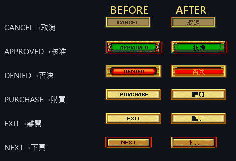
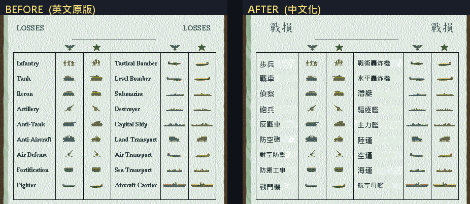
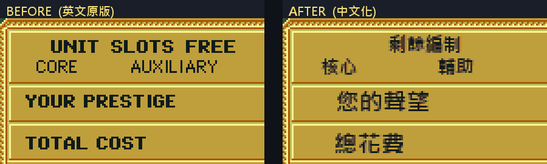

# Panzer General (繁中化) — Linux Wine + Windows portable 兩路打包

把 SSI 1994 Win95 老遊戲 *Panzer General*(繁中化 patch 版,`PG-cht.exe`)在現代環境(Ubuntu 24.04 Wine 9 / Windows 10/11)跑通,並分別打包成兩種 self-contained 單檔分發格式:

- **Linux AppImage** (366 MB) — Ubuntu 22.04+ 雙擊即跑,免裝 wine
- **Windows 7-Zip SFX** (~12 MB) — Windows 10/11 雙擊即跑,免裝 .NET / 任何 runtime

> 同引擎的 **《盟軍元帥》(Allied General, 1995)** 繁中化(含烤在點陣圖裡的 UI、開頭畫面標題、執行期狀態列)另見下方 [盟軍元帥 (Allied General) 中文化](#盟軍元帥-allied-general-中文化) 專節。
>
> 5D 系列末代 **《太平洋元帥》(Pacific General, 1997)** 繁中化與 wine/Windows 復活記錄見 [太平洋元帥 (Pacific General) 中文化](#太平洋元帥-pacific-general-中文化) 專節及 [`pacgen/`](pacgen/) 子目錄。

> 本 repo 不含 **遊戲本體**(版權所有)、**已配置 WINEPREFIX**(857 MB)、**最終 AppImage**(366 MB)、**最終 SFX .exe**,只放可重做的 **腳本、構建材料、技術文件、截圖**。

---

## 成果

| 項目 | 結果 |
|---|---|
| Wine 環境跑通 PG-cht.exe | ✅ Ubuntu 24.04 + wine 9.0 + 32-bit prefix |
| 全部中文正確顯示 | ✅ menu/對話框/按鈕/標題,字體 Source Han Sans Heavy(weight 900,粗體) |
| Self-contained Linux AppImage | ✅ 366 MB,Ubuntu 22.04+ 同等 GLIBC 環境免裝 wine 即跑 |
| Self-contained Windows SFX | ✅ ~12 MB,Win10/11 雙擊即跑,無 WinG 對話框、不寫 registry shim |
| 完整技術文件 + 構建腳本 + 領域知識 skill | ✅ 見以下目錄 |

> 原時序 6 張對照截圖已從 repo 中移除以縮小體積,僅留說明文字於 `docs/01-symptom-screenshots.md`;另補 3 張最終成果實機畫面於下方。

---

## 成果截圖(AppImage 實機)

完整修復後從 AppImage 啟動的 PG-cht.exe,中文(menu / 對話框 / 按鈕 / 戰役名)全部正常顯示為粗體。

| 畫面 | 內容 |
|---|---|
|  | **1939 戰役選擇對話框** — 視窗標題 `裝甲元帥(中文版)`、menu `(F)檔案 (E)編輯`、左側 1941 系列戰役按鈕、中央劇本說明 + 歐洲地圖背景,皆中文粗體。 |
|  | **完整劇本列表 grid** — 38 個戰役按鈕(波蘭 / 華沙 / 挪威 / 低地國 / 法國 / 海獅 / 北非 / 阿拉曼 / 高加索 / …),配合中央劇本說明對話框,證實所有戰役名稱字串都正確覆蓋。 |
|  | **進入戰場後的六角格戰術畫面** — menu `(F)檔案 (E)編輯 (G)遊戲 (V)演算`、部隊單位、地圖渲染,確認遊戲主迴圈中文亦無 □□。 |

---

## 盟軍元帥 (Allied General) 中文化

*Allied General*(SSI 1995,與 Panzer General **同引擎**)的繁體中文化。針對社群「Lite v1.1」重打包版(`AG.EXE` 2,167,611 bytes),完成 EXE 字串、資料檔、**烤在點陣圖裡的 UI**、開頭畫面標題全面中文化,並修掉重打包者藏的簽名。

### 遊戲簡介 — 經典 Hex-based 戰術骨灰作

作為 SSI 經典神作《裝甲元帥》(Panzer General) 的續作,《盟軍元帥》在 Windows 95 世代將戰場視角切換至盟軍陣營。其核心玩法本質上是一套**具備部隊養成機制的六角格 (Hex-based) 資源調度與戰術模擬系統**。

**核心架構 — 三大 Campaign**:遊戲將歷史戰役拆解為三條獨立邏輯主線,各有不同操作痛點與資源限制:

| 戰線 | 風格 | 痛點 |
|---|---|---|
| **蘇聯線 (Soviet)** | 先防禦後反攻 | 初期(巴巴羅薩行動)以空間換時間,用消耗戰拖延德軍閃電戰;中後期重工業成型後全面壓制 |
| **英國線 (British)** | 長途補給與多軍種協同 | 戰場在北非沙漠與義大利,裝甲基數小,極度依賴海空軍掩護與精準戰線維持 |
| **美國線 (American)** | 強大資源與空權壓制 | 從火炬行動推到德國本土,容錯率最高,後勤與空中火力壓倒性 |

**核心機制與戰術邏輯**:深度不在複雜操作,而在三個底層機制相互堆疊:

1. **核心部隊繼承 (Core Units Instance)** — 關卡結束時倖存部隊攜帶累積經驗值 (Stars) 直接繼承到下一關。玩家真正的核心資產是這群高經驗王牌;**避免王牌因失誤被全滅 (Permadeath) 是貫穿全局的最高原則**。
2. **科技樹演進與動態升級** — 戰役時間軸推進 (1941 → 1945) 解鎖新歷史裝備,可消耗**聲望值 (Prestige)** 升級部隊硬體。範例:輕型 M3 Stuart → 主力 M4 Sherman → 後期抗虎式主力 M26 Pershing。
3. **多兵種協同 (Combined Arms) 與地形限制** — 單一兵種衝鋒極易觸發「遭遇戰 (Rugged Defense)」而崩盤。標準戰術執行鏈:

   > 偵察車 (Recon) 開霧 → 火砲 (Artillery) 間接壓制 → 空軍洗地 → 步兵/裝甲收尾

   城市與密林等地形對裝甲有極高負面修正,須改由步兵近身清理。

**總結 — 核心價值**:成功在於「易學難精 (Easy to learn, hard to master)」。它把複雜的軍事手冊計算隱藏於簡單的攻擊/防禦數值與地形加成公式中。對喜歡沙盤推演、注重部隊養成與最優解戰術布局的玩家,本作奠定了現代回合制策略遊戲(如 *Panzer Corps*)的底層邏輯。

### 中文化後的開頭畫面

在原版 `ALLIED GENERAL` 標誌下,新增**鋼鐵漸層書法風**的「盟軍元帥」(字寬對齊英文、置中其下、套垂直銀灰漸層 + 深色描邊,直接重繪進 `ART\SPLASH.DAT` 的點陣圖):


### 完成項目

| 類別 | 內容 |
|---|---|
| EXE UI 字串 | menu / 對話框 / 按鈕 / 狀態列(Big5 就地翻譯 + RT_MENU/RT_DIALOG/RT_STRING) |
| 任務簡報 | RT_STRING 全中文,並修正兩個致命踩雷:**尾端空格 padding 造成換行大空洞**、**空字串(wLen=0)導致組字器回顯重複** |
| 回合/開戰畫面 | 天氣(晴朗/陰天/下雨/下雪)、地面(乾/泥濘/結冰)、陣營(盟軍/軸心)、月份(一~十二月) |
| 裝備名稱 | `PANZEQUP.EQP` 全中文 + 縮短(國名 1 字、刪重複英文機名;如 `美國 野馬 P51B Mustg` → `美野馬 P51B`) |
| 城市/地形/戰術標籤 | `MAPNAMES.STR`(1553/1570)、`TACMAP.TGF`(與 PG 共用) |
| **點陣圖 UI(烤在圖上)** | PREFERENCES / SETTINGS(盟德俄三版)/ 戰役按鈕 / 共用按鈕(取消·確定·購買·離開·下頁·上頁·升級·撤回·核准·否決)/ **購買部隊金牌面板(盟德俄 3 變體)** / **戰損統計表(盟德俄 3 變體 + 18 兵種名)** — 全靠逆向 `ART.DAT` 的 RLEi 編解碼重繪;小字改用**抗鋸齒**渲染求清晰 |
| 狀態列/對話框按鈕(GDI 字串) | 油料·彈藥·戰壕值·主動…、OK→確定(指標重導向)、Cancel→取消 / Yes→是 / No→否(就地翻) |
| 開頭畫面 | 加「盟軍元帥」鋼鐵漸層標題(見上) |
| **修正陣營主題(theme)bug** | 戰鬥介面 + 購買畫面 + 戰損表共用 theme 全域,蘇/德場景顯示錯主題。**真根因 = classify 比對的戰役名表被前一次翻譯就地改成中文,但場景 lookup 名仍英文 → 永不命中 → 全部落同一主題**;另有更早一次「配色 fix」把 switch 改反方向(因 classify 已壞而休眠未爆)。修法 = classify 表重指英文副本(顯示維持中文)+ switch 改回原始。實機定案 theme0=盟/1=德/2=俄 |
| **修正點陣圖洩漏 bug** | 狀態列「戰壕值/確定」指標重導向時,空區選到單位資料標籤表(0x20-stride)的 slot 內 padding,off-by-one 蓋掉前一字串 NUL → 單位面板顯示「油料:戰壕值:%d」亂入。改放真正不被索引的描述區 padding |
| **移除重打包者簽名** | 藏在狀態列(**反向 + XOR 0xFF** 編碼)的 email `raywolf@chuvashia.ru` → 改顯示玩家代號;明文 `kilroy was here.` → `盟軍元帥中文版` |

### 點陣圖 UI 中文化 — 設計概念與前後對照

這是整個專案技術含量最高的部分。**這些英文不在 EXE 字串表裡** —— 它們是「**烤**」在 `ART/ART.DAT`(~25 MB 自訂封存檔)內的**調色盤 RLE 點陣圖**。你 grep 不到、改 EXE 也沒用,只能把那一張張小圖**解碼出來、抹掉英文、重畫中文、再編碼塞回去**。

#### 共用對話按鈕(取消 / 確定 / 購買 / 核准 / 否決 …)



每顆按鈕是獨立的 RLEi chunk,連金邊、漸層底、內框、紅/綠高對比都要原樣保留 —— **去字只抹文字筆畫、不能平塗單色**,否則質感全毀。

#### 戰損統計表(整張對話框背景圖,連 18 兵種名都烤在裡面)



`LOSSES → 戰損`、`Infantry/Tank/… → 步兵/戰車/…` 全部烤在**同一張 448×441 背景圖**裡(連表格線、單位剪影、羊皮紙紋理都是)。而且**盟 / 德 / 俄各有一套變體**(`aRon`/`gRon`/`rRon`),由陣營主題自動選擇 —— 三套都要逐一重畫。

#### 購買部隊金牌資訊面板



`UNIT SLOTS FREE → 剩餘編制`、`YOUR PRESTIGE → 您的聲望` … 同樣烤在整張購買畫面背景圖,亦有盟 / 德 / 俄三變體(`ajSn`/`gcSn`/`rpSn`)。

#### 設計概念(重繪工作流)

1. **格式逆向不靠猜** —— ART.DAT = `Indx` 索引 + `CPal` 調色盤 + `RLEi` 影像。RLEi 是**逐列 RLE**(每列 `BE16 rowlen` 前綴 + run/literal/skip token)。整套文法是**反組譯遊戲自己的解碼程式**(`AG.EXE` VA `0x54CF05` 一帶,capstone)逐指令確認的 —— 寬鬆解碼器能 round-trip 自己的輸出,但遊戲解碼器更嚴,差一個 control byte 整片花屏。
2. **去字保底(保留陰影漸層)** —— 金條/面板底是帶陰影的漸層,逐列把「文字暗像素」改回**該列底色眾數**,保留頂亮邊 / 本體 / 底陰影,不平塗單色。
3. **對位用 ground-truth 投影,不用肉眼猜** —— 在生成區掃「文字色 vs 底色」的列/欄密度得到原文精確 bbox;中文畫在與英文**完全相同的位置/字高**,避開遊戲疊上的 sprite。
4. **小字清晰度靠抗鋸齒(AA)** —— 小型 CJK 用 bi-level 硬門檻會糊;把字型 glyph 的**灰階覆蓋率映到「底色↔墨色漸層」**,每階取最近調色盤色,小到 9-10px 也清楚。
5. **就地回填、archive 大小不變** —— 中文比英文短,重編碼的 stream 一定塞得進原 chunk;補零只到 `off+size` 邊界(超過會蓋掉下一個 chunk 的 header → `exMedia` 崩潰)。

> **關鍵心法**:遊戲裡找不到對應的 UI 英文,先判斷它是「**EXE 字串(GDI 即時繪字)**」還是「**烤在 ART.DAT 的點陣圖**」—— 翻了 EXE 字串重開仍英文,就是後者。兩者工具鏈完全不同。

#### 陣營主題(theme)系統 — 一個 bug 帶出的連鎖

戰鬥介面、購買畫面、戰損表**共用同一個 theme 全域**(`[0x5f1b34]`,實機定案 `theme0=盟 / 1=德 / 2=俄`),由 `classify`(把當前戰役名對「北非 8 + 西歐 14」兩張表做 `strcmp`)決定。**最隱蔽的 bug**:更早一次翻譯把 classify 比對用的戰役名表**就地翻成中文**,但程式比對時拿的是**英文 lookup 名** → 中文表 vs 英文名**永遠不命中** → 所有場景擠進同一個主題。修法 = 把 classify 表**另存英文副本並重指**(畫面顯示走另一條中文重導向,兩者拆開)。

> **教訓**:`strcmp`/lookup 用的字串表**絕不可原地翻譯**(同 `SCENARIO.TDB` 鐵則)。要顯示中文就用指標重導向另存中文副本,讓 lookup 表保留英文。

### 技術文件(可重做)

- **點陣圖 UI 中文化**(ART.DAT 索引 / CPal 調色盤 / RLEi 逐列 RLE 編解碼 / 去字保底 / 抗鋸齒小字 / 鋼鐵漸層標題):[`skills/art-dat-bitmap-cht/SKILL.md`](skills/art-dat-bitmap-cht/SKILL.md) + `tools/art-dat/`
- **EXE / 資料檔 中文化 + 執行期 UI + 破解者簽名逆向**:[`skills/panzer-general-cht/SKILL.md`](skills/panzer-general-cht/SKILL.md)、[`references/ag-ui-runtime.md`](skills/panzer-general-cht/references/ag-ui-runtime.md)

> 與 PG 相同,本 repo **不含遊戲本體**(版權所有),僅放可重做的腳本 / 技術文件 / 截圖。

### 踩雷紀錄(2026-05-30 事件)

| 事件 | 根因 | 處理 |
|---|---|---|
| **改完 email 後一進戰場就閃退** | 破解者的 email blob(`0x3d15f–0x3d17a`,reversed+XOR0xFF)**尾端 2 byte 與可執行碼重疊** —— 正好是 `call 0x43dda3` 的運算元高位 + 一個 `ret`。原本「整段 28 byte 覆寫」把 call/ret 改成 `0xFF` → 選單能開、**一進關卡執行到該段就崩潰**。 | **只改字串需要的 13 byte**(null + Big5),保留 `0x3d15f/0x3d160` 的 code byte;反組譯確認 `call+ret` 還原。詳見 [`ag-ui-runtime.md` §6](skills/panzer-general-cht/references/ag-ui-runtime.md)。**教訓:cracker 把資料藏進 .text 時常與指令交疊,改之前務必反組譯確認該 byte 不是 code。** |
| **字形與原始 Lite 不同** | 前期跟隨 PG 把字體 face `Arial`→`Tahoma`(26 處);Windows 原生對 Big5 的代換字型因此不同。 | **還原回 `Arial`**(`b"Tahoma"`→`b"Arial\0"`,26 處)。Tahoma 改法是 wine 端 Big5 fallback 用,**Windows 原生保留 `Arial` 即可**。 |
| **256 色才能執行(WinG 老遊戲)** | AG.EXE 啟動檢查 `GetDeviceCaps(BITSPIXEL)==8`,Win10/11 為 32bpp → 跳「需 256 色」對話框退出。 | 本機無編譯器 → **用 Python 手工組 32-bit PE `shim.dll`**:轉發 29 個 GDI32 函式給真 gdi32、只攔 `GetDeviceCaps` 的 BITSPIXEL→回 8;patch AG.EXE import `GDI32.dll`→`shim.dll`。手法同 pg-cht wine 的 `pgs.dll`([`panzer-general-wine`](skills/panzer-general-wine/SKILL.md))。 |

---

## 太平洋元帥 (Pacific General) 中文化

*Pacific General* (SSI/Mindscape 1997,5D General 系列末代)的繁中化與現代環境跑通指南。歷代三大誌 1997 從沒為這款寫過中文專欄;本節是 29 年後的補完。

**目錄**: [pacgen/](pacgen/) — 完整心得專欄、翻譯工具、字串 dump、譯名依據。

### 現況(v0.1 已 ship 2026-07-02)

| 項目 | 結果 |
|---|---|
| Wine 啟動配方 | ✅ `wine explorer /desktop=PACGEN,640x480 PACGEN.EXE`,無需 DLL override / no exe patch |
| PACGEN.EXE 字串 dump | ✅ 3813 條 ASCII → filter 出 356 條 UI 候選 |
| 心得專欄 (6 篇) | ✅ 序 / wine 配方 / Windows / 檔案結構 / 裝備檔 / 中文化依據 |
| TXT.PFP unpack tooling | ✅ 74 節 byte-perfect roundtrip |
| 33 個劇本 TIT/DES 中譯 | ✅ 標題 + 原創繁中史實簡報 |
| AppImage v0.1 | ✅ 769 MB (含 wine-11 + CHT 遊戲檔) |
| Windows zip v0.1 | ✅ 354 MB (portable + BJensen no-CD + 相容模式指南) |
| TXT.PFP CHT 版套用 | ⚠️ v0.1 未 ship — PFPDATA.IDX 硬編碼 offset,Big5 長度改變會撞歪索引。v0.2 補 |
| EXE UI 字串 Big5 length-preserving patch | ⏳ v0.2 |
| PACEQUIP 裝備名 813 條中譯 | ⏳ v0.2 |

### 三個 wine 踩坑(給後來的人)

DirectDraw exclusive fullscreen 老遊戲的通用坑:

1. **直接 `wine PACGEN.EXE`** → 遊戲搶主機解析度到 640x480,桌面環境要花數秒才反應過來
2. **`explorer /desktop=PACGEN,1024x768`** → 虛擬桌面尺寸不匹配 → 遊戲 window 縮成 1x1、純藍屏 20 秒
3. **`explorer /desktop=PACGEN,640x480`** → 剛好匹配 DDraw primary surface → **正常畫面**

詳解見 [pacgen/docs/01-wine-啟動配方.md](pacgen/docs/01-wine-啟動配方.md)。

### Pacific General 中文化心得專欄

| # | 篇章 | 主題 |
|---|---|---|
| [00](pacgen/docs/00-序.md) | 序 | 為什麼 1997 年沒中文版 |
| [01](pacgen/docs/01-wine-啟動配方.md) | wine 啟動配方 | DirectDraw 三個坑 |
| [02](pacgen/docs/02-modern-windows.md) | modern Windows | v1.1 patch + no-CD + 相容模式 + 字型 |
| [03](pacgen/docs/03-遊戲檔案結構.md) | 檔案結構解剖 | data / scen / Maps / bnk / stream / SMACK |
| [04](pacgen/docs/04-裝備檔解析.md) | 裝備檔解析 | 813 實體單位 + 282 佔位,EQP 結構 |
| [05](pacgen/docs/05-中文化依據.md) | 中文化依據 | Zero 為何不譯「零戰」、艦名譯法規範 |

---

## 開發成本估算(COCOMO SLOC 模型)

用經典 **COCOMO Basic**(`工作量 PM = a · KLOC^b`)反推「這套東西**用傳統方式**要投入多少人力」,再對照 **2026 AI-agent 工具棧**的實際投入。

### 實測 SLOC(本專案實際產出)

| 類別 | 檔數 | 有效碼行 |
|---|---|---|
| pg-cht repo 可重用工具(art-dat / SFX / wine / fonts) | 21 | 1,178 |
| 逆向 + patch 工作腳本(`_ag_analyze/`,多為一次性探針) | 137 | 5,006 |
| **程式碼小計** | 158 | **6,184** |
| skill / 技術文件(md) | 14 | 2,370 行 |

### COCOMO Basic 結果(取程式碼 6.18 KLOC)

| 模式 | 工作量(人月 PM) | 工期 | 並行人數 | 人年 |
|---|---|---|---|---|
| Organic 有機 | 16.3 | 7.2 mo | 2.3 | 1.35 |
| Semi-detached 半嵌入 | 23.1 | 7.5 mo | 3.1 | 1.92 |
| **Embedded 嵌入 ★採用★** | **32.0** | 7.6 mo | 4.2 | **2.67** |

### 為何這樣計算(方法論註解)

1. **為何選 Embedded 模式?** COCOMO 三模式中,Embedded 對應「**緊約束、高複雜度、新領域**」。本專案是 PE 二進位逆向 + 自訂封存檔(ART.DAT/RLEi)格式反推 + 數十處 hex patch + slot 長度/指標重導向硬約束 —— 完全吻合 Embedded 的特徵,而非一般應用程式(Organic)。

2. **為何 KLOC 取 6.18 而非只算交付工具的 1.18?** 逆向工程的本質是「**探索**」:那 5,006 行一次性分析腳本(反組譯、調色盤渲染、零區掃描、黑箱探針)**就是真實工時的載體**,不是浪費。只算最後 commit 的 1.18 KLOC 會嚴重低估。

3. **COCOMO 在此類專案的兩個系統性偏差(必須揭露)**
   - **低估**:SLOC 抓不到「**0 行卻最燒時間**」的工作 —— 讀反組譯、反推 RLEi 文法、theme 配色 bug 獵殺、逐張點陣圖目視驗證。RE 是典型的「**低 SLOC / 每行高心智成本**」。
   - **高估**:COCOMO 校準自 1980-2000 年代**團隊全生命週期**開發**新應用**,內含大量團隊溝通與流程 overhead;本案是**單人 + 大量拋棄式腳本**,沒有那層 overhead。
   - 兩者部分相抵 → **32 人月**視為「**傳統人力合理上界**」;一個資深 RE 工程師**單幹、無 AI** 的現實落點約 **4–9 人月**。

4. **★2026 工具棧現實校正(本專案即為實測 spike,非空口)★**
   - **時程**:~2026-05-16 → 05-31,約 **2 週** wall-clock 互動 session。
   - **人的投入**:給方向 + 數十輪實機測試 ≈ **30–60 小時 ≈ 0.2–0.35 人月**。
   - **AI agent**:6K 行腳本 + capstone 反組譯 + 逐 chunk patch/render 皆**分鐘級**產出;host CPU 暴力掃指標/零區/調色盤。
   - 相對「單人無 AI 的 RE」壓縮約 **10–30×**(逆向漢化這類低-SLOC-高-RE-密度工作,被現代工具放大最劇烈)。

### 結論(三個數字並陳)

| 視角 | 人力 |
|---|---|
| COCOMO 教科書(Embedded, 6.18 KLOC) | **~32 人月(2.7 人年)** |
| 資深 RE 工程師單幹、無 AI(校正 overhead 後) | **~4–9 人月** |
| **2026 實際(AI agent + 人主導測試)** | **~2 週、~0.25–0.5 人月** |

> **一句話**:COCOMO 純按行數會喊「將近 3 人年」,但那是「**用 1990s 方式硬幹的等效規模**」;在 2026 AI-agent 工具棧下實際壓到 **2 週 / 半個人月以內** —— 差距約 **30–60 倍**,正是逆向 + 漢化這類工作被現代工具放大最劇烈的典型案例。
>
> *(SLOC 由 `*.py / *.ps1 / *.sh` 去空行去純註解行統計;COCOMO 係數採教科書 Basic 值 Organic/Semi/Embedded = a:2.4/3.0/3.6, b:1.05/1.12/1.20。)*

---

## 目錄結構

```
pg-cht/
├── README.md                       # 你正在看的這份
├── WINE-FONT-SETUP.md              # 詳細技術文件(三層字體問題 + 解法)
├── docs/
│   ├── 01-symptom-screenshots.md   # 原 6 張時序截圖的敘事(□□ → 正常 → 粗體 → AppImage)+ 3 張最終成果
│   └── screenshots/                # 3 張最終成果 PNG(00/01/02);原時序 6 張未保留
├── tools/                          # 字體與 prefix 配置腳本
│   ├── setup-wine.sh               # 一鍵裝 wine + 建 prefix + DPI=136
│   ├── write-menufont.py           # 寫 binary LOGFONTW 改 menu/caption 字體
│   ├── merge-tahoma.py             # v1:Microsoft Tahoma + 教育部宋體 merge(細體)
│   ├── merge-tahoma-bold.py        # v2:Source Han Sans Heavy 改名 Tahoma(粗體,最終採用)
│   ├── replace-tahoma.py           # 把產出的字體覆蓋進 prefix,設 fontRev=32767.99
│   ├── rename-fonts.py             # 改字體 face name(mingliu/pmingliu/simsun 等別名)
│   └── fontforge.Dockerfile        # docker fontforge 環境(複雜字體操作用)
├── appimage/                       # Linux AppImage 構建材料
│   ├── README.md                   # AppImage 構建與設計筆記
│   ├── AppRun                      # 啟動腳本
│   ├── panzer-general.desktop      # XDG entry
│   ├── panzer-general.png          # icon
│   ├── wine-portable.sh            # 取代 /usr/bin/wine(原版 hardcode 路徑)
│   ├── wineserver-portable.sh      # 取代 /usr/bin/wineserver
│   ├── wineserver-dispatcher.sh    # 取代 /usr/lib/wine/wineserver
│   └── build.sh                    # 一鍵打包 .AppImage
├── windows-sfx/                    # Windows 7-Zip SFX 構建材料
│   ├── README.md                   # SFX 設計筆記 + WING32 patch 原理
│   ├── patch_wing32.py             # 對 WING32.DLL 套 2-byte patch(suppress dialog)
│   ├── PG-cht.cmd                  # 自含啟動器(__COMPAT_LAYER=256COLOR env var)
│   ├── stamp_icon.ps1              # Win32 UpdateResource P/Invoke icon stamper
│   ├── build_sfx.ps1               # 一鍵打包 .exe(stage→.7z→config→stamp→concat)
│   └── Remove-256Color-Shim.reg    # 清掉舊 HKCU AppCompat shim
└── skills/
    ├── panzer-general-cht/SKILL.md       # PG/AG 中文化領域知識
    ├── panzer-general-wine/SKILL.md      # wine 啟動環境(256 色 bypass via pgs.dll)
    └── wing-portable-sfx/SKILL.md        # Windows 原生 + SFX 打包(WING32 patch + __COMPAT_LAYER)
```

---

## 快速使用

### 方式 A1:跑現成 AppImage (Linux,若你已有 `PanzerGeneral-x86_64.AppImage`)

```bash
chmod +x PanzerGeneral-x86_64.AppImage
./PanzerGeneral-x86_64.AppImage
```

第一次啟動約 30 秒(解 prefix + 遊戲到 `~/.local/share/PanzerGeneral/`),後續秒開。

### 方式 A2:跑現成 SFX (Windows,若你已有 `PanzerGeneralCHT-1.2-portable.exe`)

雙擊 `.exe` → 跳出對話框「即將解壓並啟動 Panzer General」→ 選解壓位置 → 解壓完自動啟動。

第一次解壓 ~12 MB → ~42 MB 大概 3-5 秒,主視窗「裝甲元帥遊戲選項」7 秒內出現。下次只要從解壓資料夾跑 `PG-cht.cmd` 即可。

### 方式 B:從零重做整個環境

```bash
# 1. 裝 wine + 設 DPI = 136 + 建 32-bit prefix
./tools/setup-wine.sh

# 2. 把繁中字體裝進 prefix(教育部標準宋體 + Source Han Sans)
sudo apt-get install -y fonts-moe-standard-song python3-fonttools winetricks
winetricks -q corefonts tahoma cjkfonts        # corefonts + Microsoft Tahoma + CJK fonts

# 3. 三層解法
#    3a. 改 menu/caption 字體(寫 binary LOGFONTW 到 WindowMetrics)
python3 tools/write-menufont.py && wine regedit /S /tmp/pg-cht-menufont.reg

#    3b. 把 tahoma.ttf 換成 Source Han Sans Heavy + CJK + face name=Tahoma + fontRev=32767.99
python3 tools/merge-tahoma-bold.py

#    3c. (可選) 同樣做法 + 鋪 simsun/mingliu/pmingliu 別名
python3 tools/rename-fonts.py

# 4. (可選) 打包成 AppImage
GAME_DIR=/path/to/PG-cht-game/ \
WINEPREFIX=$HOME/.wine-pgcht \
OUTPUT=PanzerGeneral-x86_64.AppImage \
    ./appimage/build.sh
```

### 方式 C:Windows 原生 + 自製 SFX (Win10 / 11)

```powershell
# 1. 對遊戲目錄裡的 WING32.DLL 套 2-byte patch (suppress "WinG Installation Error")
python windows-sfx\patch_wing32.py <游戲資料夾>\WING32.DLL

# 2. 確認啟動器在遊戲資料夾裡 (預設應該有)
copy windows-sfx\PG-cht.cmd <游戲資料夾>\

# 3. 雙擊 <游戲資料夾>\PG-cht.cmd 驗證能跑 (主視窗 7 秒內到「裝甲元帥遊戲選項」)

# 4. (可選) 打包成單檔 SFX .exe
powershell -ExecutionPolicy Bypass -File windows-sfx\build_sfx.ps1 `
  -Source <游戲資料夾> `
  -Output PanzerGeneralCHT-1.2-portable.exe
```

只依賴 Windows 內附的 7-Zip (`C:\Program Files\7-Zip\`) + PowerShell 5.1 + Win32 API。不需要 NSIS / Inno Setup / rcedit / Resource Hacker。

---

## 三層字體問題(摘要,完整見 [`WINE-FONT-SETUP.md`](WINE-FONT-SETUP.md))

| 層 | 失敗點 | 解法 |
|---|---|---|
| **內文 (TextOutA)** | Wine ACP 不是 950 / 字體沒標 CP950 / 字體缺 CJK glyph | `LANG=zh_TW.UTF-8` 推導 ACP=950 + 字體 `OS/2.ulCodePageRange1` 補 bit 20 |
| **menu/status/caption** | Wine 對 raster `.fon` 不走 FontSubstitutes | 直接寫 binary LOGFONTW(92 bytes)到 `HKCU\Control Panel\Desktop\WindowMetrics` |
| **應用硬呼叫 Tahoma** | Microsoft Tahoma 沒 CJK glyph | 覆蓋 `tahoma.ttf` 為「Source Han Sans Heavy + 改名 Tahoma + fontRev=32767.99」 |

兩個關鍵雷:
1. Wine 同 face name 多個檔時按 `head.fontRevision` 大者勝(**與路徑無關**) → 自己改的字體要拉到 32767.99
2. AppImage 內 `/usr/bin/wine` 原版 `wine-stable` script hardcode `/usr/lib/wine/wine` 絕對路徑 → 重寫成相對路徑

---

## Windows 端的三個踩坑(摘要,完整見 [`windows-sfx/README.md`](windows-sfx/README.md))

| 問題 | 根因 | 解法 |
|---|---|---|
| 每次啟動跳「WinG Installation Error」對話框 | Win10/11 SysWOW64 中的 `WING32.DLL` (Microsoft 12800-byte build) 內建路徑檢查預期住在 `C:\Windows\System`,在 SysWOW64 永遠認定「裝錯位置」 | 對 `WING32.DLL` 套 file offset `0xA55` 的 2-byte patch:`75 11` (jnz dialog) → `90 90` (nop nop),永遠走 success path。**禁區**:不能直接 NOP `0xA9B` 的 `call MessageBoxA` (會 `0xC0000142` DllMain init failed,MessageBoxA 內部 pump messages 釋放 loader lock,跳過會卡死) |
| 畫面整片花/黑 | 32 bpp 桌面但 WinG 預期 8-bit palette | 啟動器設 `__COMPAT_LAYER=256COLOR` env var (單行程作用域,等效 Properties → "Reduced color mode" 但不寫 registry → 可攜) |
| 7-Zip SFX 打包出來 12 MB 變 196 KB | Win32 `UpdateResource()` 把 PE image size 當 EOF,**會截掉 appended overlay** | Icon 必須先 stamp 在 `7z.sfx` stub 副本上,**再**和 config + payload 三段 concat |

額外 BOM 矩陣 (同一份工作流產生三種檔案,對「BOM 是否該存在」答案各異):

| 檔案 | Reader | BOM? |
|---|---|---|
| `.ps1` | PowerShell 5.1 (Windows PowerShell) | **要**。沒 BOM 預設用 ANSI codepage 讀,中文字面值會 garbled |
| SFX `config.txt` | `7z.sfx` stub | **要 BOM + CRLF**,不然 config 被略過 |
| `SKILL.md` | Claude 的 skill loader | **絕對不要 BOM**。YAML frontmatter 解析器需要 `---` 在 byte 0 |

---

## 環境

**Linux 端 (AppImage 構建):**
- Ubuntu 24.04 LTS、x86_64
- Wine 9.0(`wine` + `wine32:i386` + `wine64` + `libwine:i386`)
- 字體:`fonts-moe-standard-song`、`fonts-noto-cjk`、winetricks `tahoma` + `cjkfonts`
- 工具:`python3-fonttools`、docker(fontforge)、`appimagetool`(從 GitHub releases)

**Windows 端 (SFX 構建):**
- Windows 10 / 11、x64
- 7-Zip 18+(`C:\Program Files\7-Zip\7z.exe` + `7z.sfx`)
- Windows PowerShell 5.1 (內附) 或 PowerShell 7+
- Python 3.x(跑 `patch_wing32.py`,沒 third-party 相依)
- 不需要 NSIS / Inno Setup / rcedit / Resource Hacker

---

## 已知限制

**Linux/AppImage:**
- AppImage 鎖定 GLIBC 2.39+(Ubuntu 24.04 編譯的 wine),舊 distro 可能跑不起來
- 最終粗體版西文也用 Source Han Sans Heavy 黑體(非 Microsoft Tahoma 細緻字形)。要回細體版可重跑 `tools/merge-tahoma.py`
- 工作目錄含中文時 wine 會因 `LC_CTYPE` 解碼失敗;AppRun 已把遊戲解到純 ASCII 路徑避開
- 不打包 Mono / Gecko(`WINEDLLOVERRIDES=mscoree,mshtml=` 跳過)

**⚠️ WSL / new-WoW64-only wine 跑不起來(PG 與 AG 同崩,2026-05-31 實測):**
- 在 **WSL (Ubuntu 22.04/24.04)** 用 `winehq-stable` 跑 `PG-cht.exe` 或姊妹作 `AG.EXE`,thread-start 立刻 crash。`WINEDEBUG=+seh` 看到:
  - AG → `EXCEPTION_ACCESS_VIOLATION addr=0x005CB003`、PG → `addr=0x005C8010`
  - 共同指紋:崩潰 VA = `ImageBase + .rdata/DebugDir 起點`(**不是** entry point);`edx` = 該 exe 的 entry VA(已算好卻沒進去);`eax=ebx=0x7ffd1000`(TEB);fault 寫 NULL。
- **根因**:WSL 的 `winehq-stable` 是 **new-WoW64-only build**——`/opt/wine-stable/bin/wine` 是 64-bit ELF、**沒有 `wine-preloader`**,所有 32-bit exe 都走 wow64 thunk,沒有真 32-bit 執行路徑(`WINEARCH=win32` 也躲不掉)。這個 wow64 thread-start 對 1994–96 老 PE(有 `IMAGE_DEBUG_DIRECTORY`/FPO、`.bss` filesize=0)會把控制權送到 `.rdata` 開頭當 code 跑 → 撞 write-to-NULL。
- **反證(與遊戲/patch 無關)**:PG 套完整 nil-deref patch 後在 WSL **仍崩同一位址**;AG 的 Lite 版與完整版 AG.EXE **byte-identical**,WSL 同崩、但 Lite 的 AppImage 在實機真 32-bit wine 能跑。
- **解法**:用**真 32-bit wine**(要有 `wine-preloader`)——即本 repo AppImage 構建用的 Ubuntu 24.04 + Wine 9.0(`wine32:i386`)。判斷一台 wine 是否安全:`file "$(command -v wine)"` 要是 32-bit / 或同目錄有 `wine-preloader`;純 64-bit ELF 且無 preloader = wow64-only = 本雷,別在這台浪費時間。

**Windows/SFX:**
- WING32.DLL patch 只驗證過 Microsoft 12800-byte build (SHA256 `bb1f552e25...`)。其他來源的 WING32.DLL 可能 offset 不同,`patch_wing32.py` 有 SHA256 sanity 會擋下
- SFX 是 installer-style 不是 temp-style — 存檔保留在使用者選的解壓資料夾,不會自動清。要 temp 行為改用 `7zSD.sfx` (modSFX) 但存檔會丟
- 沒包 code signing,Windows SmartScreen 第一次跑可能跳「未知發行者」警告 (按「其他資訊 → 仍要執行」)

---

## License

腳本與文件:MIT(僅限本 repo 的原創部分)
遊戲本體:SSI / Mindscape 版權,**未包含於此 repo**
教育部標準宋體:中華民國教育部
Source Han Sans:Adobe / Google,SIL Open Font License 1.1
Microsoft Tahoma:Microsoft Corporation(由使用者自備)
