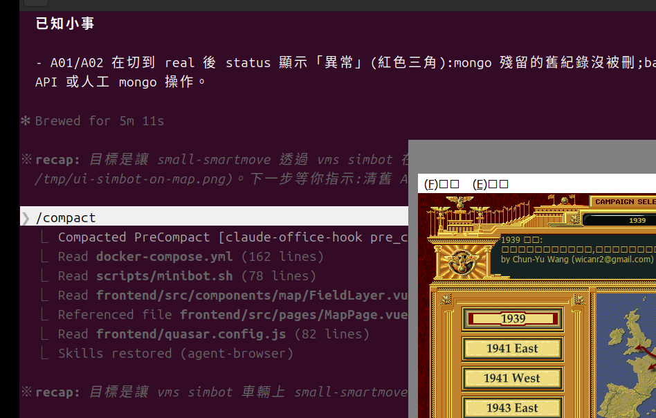
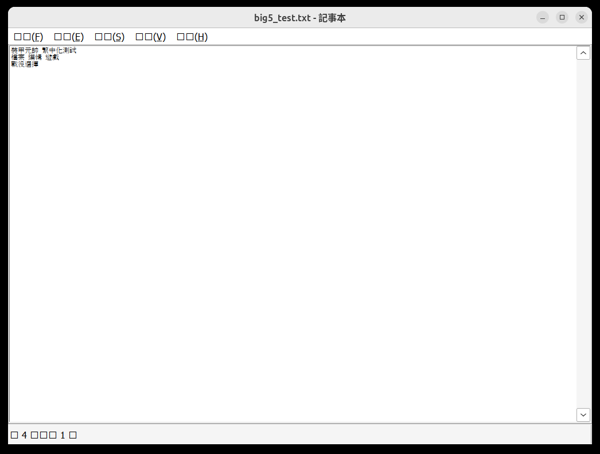
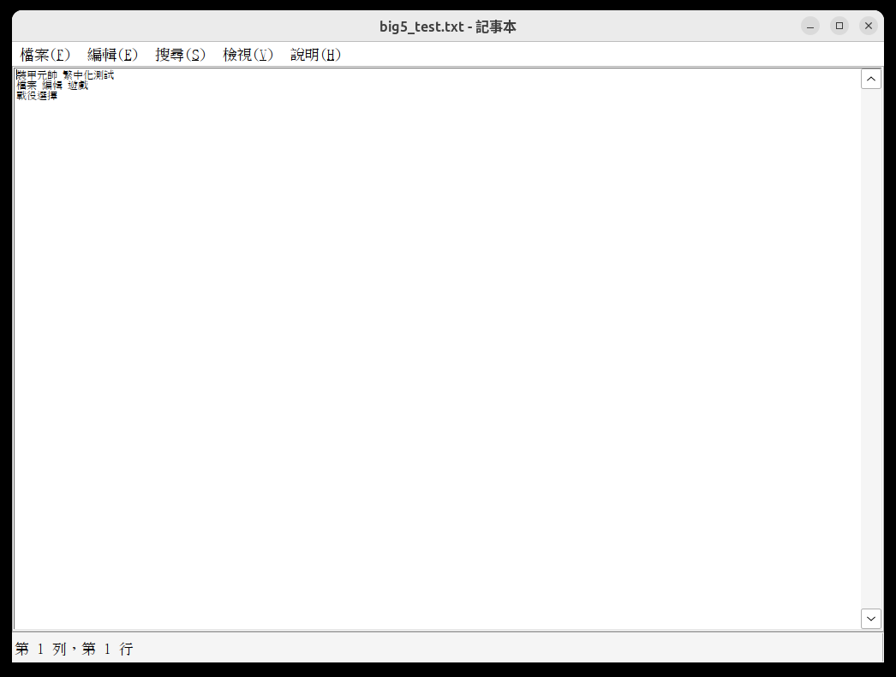
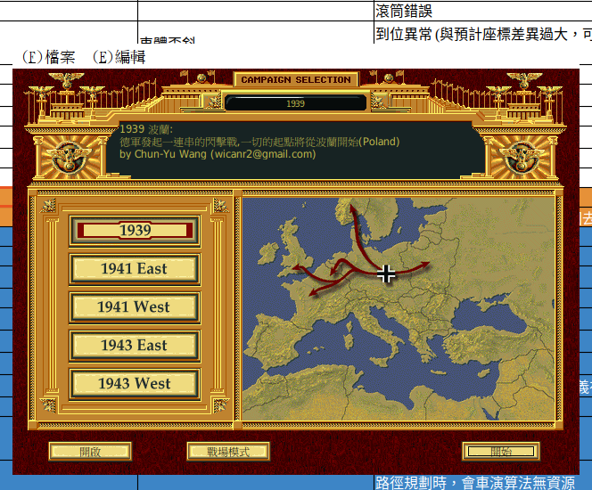
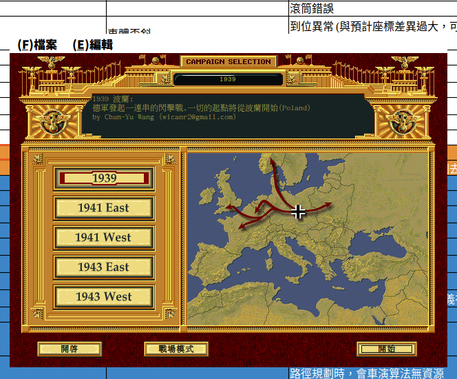

# 視覺化:從 □□ 到完整中文粗體的演進

按時序看 6 張截圖,對應 [`WINE-FONT-SETUP.md`](../WINE-FONT-SETUP.md) 的三層問題與解法。

> ⚠️ 原始 PNG 已從 repo 移除以縮小體積,以下 `` 路徑會顯示為破圖。文字敘事保留,作為實作過程的時序記錄。

---

## 01. 起點:全部 □□

- 環境:wine 9.0 + WINEPREFIX 初始狀態 + 系統有 `fonts-wqy-microhei`
- 主視窗 `裝甲元帥(中文版)` menu bar `(F)□□ (E)□□`
- 對話框 `1939 □□: □□□□□□□□□□□□...(Poland)`
- 底部按鈕 `□□ / □□□□ / □□`
- 西文部分(`by Chun-Yu Wang`、`1939/1941 East/...`)正常

**症狀分類**:看似一個問題,實際上是三層獨立失敗(內文 codepage、menu raster .fon、應用呼叫 "Tahoma" 缺 CJK)。

---

## 02. 中介驗證:wine notepad 開 Big5 文字檔

- 寫了一個 Big5 編碼的測試文字檔(`/tmp/big5_test.txt`),`wine notepad` 開
- **內文區「裝甲元帥 繁中化測試 / 檔案 編輯 遊戲 / 戰役選擇」正常顯示** → wine `TextOutA` 配 `ACP=950` 已 OK
- **menu bar `□□(F) □□(E) □□(S) □□(V) □□(H)`、status bar `□ 4 □□□ 1 □` 仍 □□** → menu 用 raster `.fon` 字體不走 FontSubstitutes

這張圖把 PG-cht 的問題清楚切成「兩半」:**內文路徑已通,menu/status 還沒通**。

---

## 03. notepad menu 修好

- 直接寫 binary `LOGFONTW`(92 bytes)到 `HKCU\Control Panel\Desktop\WindowMetrics` 的 `MenuFont` / `CaptionFont` / `StatusFont` / `MessageFont` / `SmCaptionFont` / `IconFont`
- `lfFaceName = PMingLiU`(或 Tahoma,只要該 face 有 CJK glyph)
- `lfCharSet = 1 (DEFAULT_CHARSET)`
- notepad menu bar `檔案(F) 編輯(E) 搜尋(S) 檢視(V) 說明(H)`、status bar `第 1 列,第 1 行`、視窗標題 `big5_test.txt - 記事本` 全部正確顯示

這個技術可直接套到 PG-cht — menu bar 同樣是 raster `.fon` 路徑,改 `MenuFont` 同樣有效。

---

## 04. PG-cht.exe:merge Tahoma 細體版

- 把使用者提供的 Microsoft `Tahoma.ttf`(西文 glyph,Latin-only)用 `fontTools.merge` 與 `MoeStandardSong.ttf`(教育部標準宋體,有 CJK)合成
- 合成後 face name 仍叫 `Tahoma`,cmap 26131,標 CP950 bit 20,`head.fontRevision = 32767.99`(贏過 `/usr/share/wine/fonts/tahoma.ttf` Microsoft 版的 13333)
- 覆蓋進 `<WINEPREFIX>/drive_c/windows/Fonts/tahoma.ttf` 與 `tahomabd.ttf`
- 結果:`(F)檔案 (E)編輯` `1939 波蘭:` `德軍崛起一連串的閃擊戰,一切的起點將從波蘭開始(Poland)` `開啟 / 戰場模式 / 開始` 全部正確

**美學**:西文用 Microsoft Tahoma 原版字形(較細緻),CJK 用宋體 fallback。

---

## 05. PG-cht.exe:Source Han Sans Heavy 粗體版

- 使用者要求文字粗體
- 嘗試過 fontforge `changeWeight` 對細體 Tahoma+宋體加粗,但複雜 CJK glyph 觸發 outline overlap bug,部分字回到 □□
- 改換成「字體本身就是粗的」:從 `sourcehansans.ttc` 取 idx=20 (Source Han Sans Heavy, weight 900),`pyftsubset` 留所需 codepoint,改 family name = Tahoma、fontRev=32767.99
- 副作用:西文也用 Heavy 黑體(失去 Microsoft Tahoma 字形),trade-off 可接受
- 結果:全部文字粗體且清晰

劇本選擇畫面所有 38 個戰役名(波蘭/華沙/挪威/低地國/法國/海獅/北非/中東/阿拉曼/高加索/...)都正常顯示。

---

## 06. AppImage self-contained 運行

- 把 wine + 32-bit i386 fake DLLs + 配好的 prefix + 遊戲檔全打包成 `PanzerGeneral-x86_64.AppImage`(zstd squashfs,366 MB)
- 完全清掉系統 wine cache 後測試:`./PanzerGeneral-x86_64.AppImage` 第一次啟動約 30 秒(解 prefix + game 到 `~/.local/share/PanzerGeneral/`),後續秒開
- 截圖即從 AppImage 內運行的 PG-cht.exe,粗體中文與第 05 張一樣

整套移植與打包流程到此完整收尾。詳細技術背景見 [`WINE-FONT-SETUP.md`](../WINE-FONT-SETUP.md)。
