# 盟軍元帥 Allied General（SSI 1995） — 戰役分支路線（大勝 / 小勝 / 落敗 → 下一戰場 + 聲望）

盟軍視角、北非→南歐→西歐與東線的分支戰役。同 5D 引擎，SCENARIO.TDB 共 **39 個劇本**，分支資料比 PG 完整（全檔僅 3 處 `????`）。

> **注意（issue #4）**：本 repo 的 AG 散布套件已在蘇軍(東線)路線**加入第 40 個劇本 Kursk 庫斯克**，實際鏈路改為 **哈爾科夫'43 → 庫斯克 → 第聶伯河**。下表為**原版 39 劇本**結構;Kursk 的加入方式(素材、引擎接線、驗證)見 [`kursk-mod-ag.md`](kursk-mod-ag.md)。

## 資料來源與 provenance

- **分支與聲望全部抽自遊戲檔** `DATA/SCENARIO.TDB`（SSI 5D 引擎的純文字資料庫，`.` 分隔欄位、CRLF 分隔記錄；本 repo 三個 PG/AG 安裝的此檔 md5 一致）。
- 該檔**最後一列是自我說明的 legend 列**，直接定義各欄語意，因此欄位對應無須臆測：
  ```
  Scenario Name | painting | decisive Scenario Name | marginal Scenario Name | loss Scenario Name | wcnt | timo | dvps | mvps | lspr
  ```
  | 檔內欄位 | 語意 | 對應本文 |
  |---|---|---|
  | `decisive Scenario Name` | 大勝（決定性勝利）後進入的劇本 | 大勝 MAJOR → 下一戰場 |
  | `marginal Scenario Name` | 小勝（邊際勝利）後進入的劇本 | 小勝 MINOR → 下一戰場 |
  | `loss Scenario Name` | 落敗後進入的劇本 | 落敗 LOSS → 下一戰場 |
  | `dvps` / `mvps` / `lspr` | 大勝 / 小勝 / 落敗的聲望獎勵 | 各欄括號內 `+N` |
- 聲望（prestige）為該結果的**基礎獎勵值**；實戰另受難度盤（-2…+2，50%…200%）與戰場表現增減，此處為檔內基準值。
- 中文劇本名取自本 repo 既有 `ag-scenarios.tsv`（台灣軍事史學界慣用譯名）。
- 結局 / 特殊代碼：`DWIN`=大勝結局、`MWIN`=小勝結局、`DRAW`=平手、`LOSS`=戰敗結局、`????`=該欄未存後續劇本名。

> **戰役起點**：北非線起於「西迪巴拉尼（Sidi Barrani）1940-12」；本作 SCENSTAT.BIN 為 PG 殘留、與 AG 無關，故劇本順序改採歷史 / 戰場分節排序。

## 分支總表

劇本按戰場 / 年代排序（非檔內字母序）。「→」右側為該結果進入的下一戰場，括號 `+N` 為獲得聲望。

| # | 劇本（中 / 英） | 年代 | 大勝 MAJOR → 下一戰場 | 小勝 MINOR → 下一戰場 | 落敗 LOSS → 下一戰場 |
|---:|---|---|---|---|---|
| 1 | 西迪巴拉尼（Sidi Barrani） | 1940-12 | 埃阿蓋拉（El Agheila） `+300` | 埃阿蓋拉（El Agheila） `+200` | 戰敗結局（`LOSS`） `+100` |
| 2 | 埃阿蓋拉（El Agheila） | 1941-02 | 墨薩布雷加（Mersa El Brega） `+500` | 十字軍作戰（Crusader） `+300` | 十字軍作戰（Crusader） `+100` |
| 3 | 墨薩布雷加（Mersa El Brega） | 1941-03 | 的黎波里 (架空)（Tripoli） `+700` | 加查拉（Gazala） `+300` | 阿拉曼（El Alamein） `+200` |
| 4 | 的黎波里 (架空)（Tripoli） | 1941-01 | ★大勝結局（`DWIN`） `+0` | ★大勝結局（`DWIN`） `+0` | 阿拉曼（El Alamein） `+300` |
| 5 | 十字軍作戰（Crusader） | 1941-11 | 的黎波里 (架空)（Tripoli） `+700` | 墨薩布雷加（Mersa El Brega） `+400` | 開羅 (架空)（Cairo） `+200` |
| 6 | 加查拉（Gazala） | 1942-05 | 的黎波里 (架空)（Tripoli） `+700` | 阿拉曼（El Alamein） `+400` | 阿拉曼（El Alamein） `+200` |
| 7 | 阿拉曼（El Alamein） | 1942-10 | ★大勝結局（`DWIN`） `+0` | ☆小勝結局（`MWIN`） `+0` | 戰敗結局（`LOSS`） `+0` |
| 8 | 開羅 (架空)（Cairo） | 1942-07 | 加查拉（Gazala） `+600` | ☆小勝結局（`MWIN`） `+0` | 戰敗結局（`LOSS`） `+0` |
| 9 | 火炬作戰（Torch） | 1942-11 | 馬雷特線（Mareth Line） `+800` | 卡塞林隘口（Kasserine） `+600` | 卡塞林隘口（Kasserine） `+500` |
| 10 | 卡塞林隘口（Kasserine） | 1943-02 | 突尼斯（Tunis） `+700` | 馬雷特線（Mareth Line） `+500` | 馬雷特線（Mareth Line） `+400` |
| 11 | 馬雷特線（Mareth Line） | 1943-03 | 突尼斯（Tunis） `+800` | 突尼斯（Tunis） `+500` | 安濟奧（Anzio） `+300` |
| 12 | 突尼斯（Tunis） | 1943-05 | 西西里（Sicily） `+600` | 西西里（Sicily） `+500` | 戰敗結局（`LOSS`） `+0` |
| 13 | 西西里（Sicily） | 1943-07 | 木星作戰 (架空)（Jupiter） `+600` | 安濟奧（Anzio） `+500` | 安濟奧（Anzio） `+400` |
| 14 | 木星作戰 (架空)（Jupiter） | 1943-08 | 大君主 (諾曼第)（Overlord） `+800` | 大君主 (諾曼第)（Overlord） `+600` | 眼鏡蛇作戰（Cobra） `+400` |
| 15 | 安濟奧（Anzio） | 1944-01 | 大君主 (諾曼第)（Overlord） `+600` | 大君主 (諾曼第)（Overlord） `+500` | 戰敗結局（`LOSS`） `+0` |
| 16 | 大君主 (諾曼第)（Overlord） | 1944-06 | `????`（未定義） `+800` | 眼鏡蛇作戰（Cobra） `+600` | 戰敗結局（`LOSS`） `+0` |
| 17 | 眼鏡蛇作戰（Cobra） | 1944-07 | `????`（未定義） `+800` | `????`（未定義） `+600` | 戰敗結局（`LOSS`） `+0` |
| 18 | 默茲河（Meuse） | 1944-09 | 兵臨萊茵河（To The Rhine） `+600` | 兵臨萊茵河（To The Rhine） `+500` | 戰敗結局（`LOSS`） `+0` |
| 19 | 摩澤爾河（Moselle） | 1944-10 | 兵臨萊茵河（To The Rhine） `+600` | 兵臨萊茵河（To The Rhine） `+500` | 戰敗結局（`LOSS`） `+0` |
| 20 | 兵臨萊茵河（To The Rhine） | 1944-11 | 德國本土（Germany） `+600` | 魯爾包圍（Ruhr） `+500` | 戰敗結局（`LOSS`） `+0` |
| 21 | 魯爾包圍（Ruhr） | 1945-03 | 德國本土（Germany） `+600` | 德國本土（Germany） `+500` | 戰敗結局（`LOSS`） `+0` |
| 22 | 德國本土（Germany） | 1945-04 | ★大勝結局（`DWIN`） `+0` | ★大勝結局（`DWIN`） `+0` | ☆小勝結局（`MWIN`） `+0` |
| 23 | 柏林戰役（Berlin） | 1945-04 | ★大勝結局（`DWIN`） `+0` | ★大勝結局（`DWIN`） `+0` | ★大勝結局（`DWIN`） `+0` |
| 24 | 芬蘭戰場（Finland） | 1941-06 | 普斯科夫（Pskov） `+750` | 普斯科夫（Pskov） `+500` | 普斯科夫（Pskov） `+250` |
| 25 | 普斯科夫（Pskov） | 1941-07 | 維亞茲馬（Vyazma） `+1500` | 列寧格勒圍城（Leningrad） `+750` | 莫斯科（Moscow） `+500` |
| 26 | 維亞茲馬（Vyazma） | 1941-10 | 哈爾科夫 (1942)（Kharkov '42） `+1000` | 史達林格勒（Stalingrad） `+750` | 史達林格勒（Stalingrad） `+500` |
| 27 | 列寧格勒圍城（Leningrad） | 1941-09 | 維亞茲馬（Vyazma） `+1000` | 維亞茲馬（Vyazma） `+500` | 莫斯科（Moscow） `+250` |
| 28 | 莫斯科（Moscow） | 1941-11 | 維亞茲馬（Vyazma） `+1000` | 維亞茲馬（Vyazma） `+500` | 戰敗結局（`LOSS`） `+0` |
| 29 | 哈爾科夫 (1942)（Kharkov '42） | 1942-05 | 第聶伯河（Dniepr） `+4000` | 史達林格勒（Stalingrad） `+1000` | 史達林格勒（Stalingrad） `+500` |
| 30 | 史達林格勒（Stalingrad） | 1942-08 | 羅斯托夫（Rostov） `+1500` | 羅斯托夫（Rostov） `+750` | 戰敗結局（`LOSS`） `+0` |
| 31 | 羅斯托夫（Rostov） | 1943-02 | 第聶伯河（Dniepr） `+1500` | 哈爾科夫 (1943)（Kharkov '43） `+750` | 哈爾科夫 (1943)（Kharkov '43） `+250` |
| 32 | 哈爾科夫 (1943)（Kharkov '43） | 1943-02 | 第聶伯河（Dniepr） `+1500` | 第聶伯河（Dniepr） `+1000` | 日托米爾（Zhitomir） `+750` |
| 33 | 第聶伯河（Dniepr） | 1943-08 | 明斯克（Minsk） `+2500` | 科爾松合圍（Korsun） `+1500` | 日托米爾（Zhitomir） `+500` |
| 34 | 科爾松合圍（Korsun） | 1944-01 | 明斯克（Minsk） `+2000` | 明斯克（Minsk） `+1250` | 日托米爾（Zhitomir） `+1000` |
| 35 | 明斯克（Minsk） | 1944-06 | 德布勒森（Debrecen） `+2000` | 普洛耶什蒂（Ploesti） `+1250` | 日托米爾（Zhitomir） `+500` |
| 36 | 德布勒森（Debrecen） | 1944-10 | 柏林戰役（Berlin） `+2000` | 巴拉頓湖（Lake Balaton） `+1250` | 巴拉頓湖（Lake Balaton） `+500` |
| 37 | 普洛耶什蒂（Ploesti） | 1944-08 | 德布勒森（Debrecen） `+1500` | 德布勒森（Debrecen） `+750` | 日托米爾（Zhitomir） `+500` |
| 38 | 巴拉頓湖（Lake Balaton） | 1945-03 | 柏林戰役（Berlin） `+1500` | 柏林戰役（Berlin） `+750` | ☆小勝結局（`MWIN`） `+500` |
| 39 | 日托米爾（Zhitomir） | 1943-11 | 德布勒森（Debrecen） `+2000` | ☆小勝結局（`MWIN`） `+0` | ☆小勝結局（`MWIN`） `+0` |

## `????` 分支說明（重要）

- `????` 是檔內字面存的 4 個問號（非解碼失敗），代表 **SCENARIO.TDB 在該結果欄未存明確後續劇本名**。
- 本作僅 3 處 `????`（如眼鏡蛇 Cobra 大勝 / 小勝、大君主 Overlord 大勝），代表該結果下無存後續劇本名（多為戰役收尾 / 引擎處理）。上表只呈現檔內實存值，不臆造。

## 勝利前進路線 mermaid

只畫「大勝 / 小勝」通往**實際劇本**的連線（實線=大勝、虛線=小勝）；`????`、落敗與結局分支見上表。

```mermaid
graph LR
  S_SidiBarrani["西迪巴拉尼"] --> S_ElAgheila["埃阿蓋拉"]
  S_SidiBarrani["西迪巴拉尼"] -.-> S_ElAgheila["埃阿蓋拉"]
  S_ElAgheila["埃阿蓋拉"] --> S_MersaElBrega["墨薩布雷加"]
  S_ElAgheila["埃阿蓋拉"] -.-> S_Crusader["十字軍作戰"]
  S_MersaElBrega["墨薩布雷加"] --> S_Tripoli["的黎波里 (架空)"]
  S_MersaElBrega["墨薩布雷加"] -.-> S_Gazala["加查拉"]
  S_Crusader["十字軍作戰"] --> S_Tripoli["的黎波里 (架空)"]
  S_Crusader["十字軍作戰"] -.-> S_MersaElBrega["墨薩布雷加"]
  S_Gazala["加查拉"] --> S_Tripoli["的黎波里 (架空)"]
  S_Gazala["加查拉"] -.-> S_ElAlamein["阿拉曼"]
  S_Cairo["開羅 (架空)"] --> S_Gazala["加查拉"]
  S_Torch["火炬作戰"] --> S_MarethLine["馬雷特線"]
  S_Torch["火炬作戰"] -.-> S_Kasserine["卡塞林隘口"]
  S_Kasserine["卡塞林隘口"] --> S_Tunis["突尼斯"]
  S_Kasserine["卡塞林隘口"] -.-> S_MarethLine["馬雷特線"]
  S_MarethLine["馬雷特線"] --> S_Tunis["突尼斯"]
  S_MarethLine["馬雷特線"] -.-> S_Tunis["突尼斯"]
  S_Tunis["突尼斯"] --> S_Sicily["西西里"]
  S_Tunis["突尼斯"] -.-> S_Sicily["西西里"]
  S_Sicily["西西里"] --> S_Jupiter["木星作戰 (架空)"]
  S_Sicily["西西里"] -.-> S_Anzio["安濟奧"]
  S_Jupiter["木星作戰 (架空)"] --> S_Overlord["大君主 (諾曼第)"]
  S_Jupiter["木星作戰 (架空)"] -.-> S_Overlord["大君主 (諾曼第)"]
  S_Anzio["安濟奧"] --> S_Overlord["大君主 (諾曼第)"]
  S_Anzio["安濟奧"] -.-> S_Overlord["大君主 (諾曼第)"]
  S_Overlord["大君主 (諾曼第)"] -.-> S_Cobra["眼鏡蛇作戰"]
  S_Meuse["默茲河"] --> S_ToTheRhine["兵臨萊茵河"]
  S_Meuse["默茲河"] -.-> S_ToTheRhine["兵臨萊茵河"]
  S_Moselle["摩澤爾河"] --> S_ToTheRhine["兵臨萊茵河"]
  S_Moselle["摩澤爾河"] -.-> S_ToTheRhine["兵臨萊茵河"]
  S_ToTheRhine["兵臨萊茵河"] --> S_Germany["德國本土"]
  S_ToTheRhine["兵臨萊茵河"] -.-> S_Ruhr["魯爾包圍"]
  S_Ruhr["魯爾包圍"] --> S_Germany["德國本土"]
  S_Ruhr["魯爾包圍"] -.-> S_Germany["德國本土"]
  S_Finland["芬蘭戰場"] --> S_Pskov["普斯科夫"]
  S_Finland["芬蘭戰場"] -.-> S_Pskov["普斯科夫"]
  S_Pskov["普斯科夫"] --> S_Vyazma["維亞茲馬"]
  S_Pskov["普斯科夫"] -.-> S_Leningrad["列寧格勒圍城"]
  S_Vyazma["維亞茲馬"] --> S_Kharkov42["哈爾科夫 (1942)"]
  S_Vyazma["維亞茲馬"] -.-> S_Stalingrad["史達林格勒"]
  S_Leningrad["列寧格勒圍城"] --> S_Vyazma["維亞茲馬"]
  S_Leningrad["列寧格勒圍城"] -.-> S_Vyazma["維亞茲馬"]
  S_Moscow["莫斯科"] --> S_Vyazma["維亞茲馬"]
  S_Moscow["莫斯科"] -.-> S_Vyazma["維亞茲馬"]
  S_Kharkov42["哈爾科夫 (1942)"] --> S_Dniepr["第聶伯河"]
  S_Kharkov42["哈爾科夫 (1942)"] -.-> S_Stalingrad["史達林格勒"]
  S_Stalingrad["史達林格勒"] --> S_Rostov["羅斯托夫"]
  S_Stalingrad["史達林格勒"] -.-> S_Rostov["羅斯托夫"]
  S_Rostov["羅斯托夫"] --> S_Dniepr["第聶伯河"]
  S_Rostov["羅斯托夫"] -.-> S_Kharkov43["哈爾科夫 (1943)"]
  S_Kharkov43["哈爾科夫 (1943)"] --> S_Dniepr["第聶伯河"]
  S_Kharkov43["哈爾科夫 (1943)"] -.-> S_Dniepr["第聶伯河"]
  S_Dniepr["第聶伯河"] --> S_Minsk["明斯克"]
  S_Dniepr["第聶伯河"] -.-> S_Korsun["科爾松合圍"]
  S_Korsun["科爾松合圍"] --> S_Minsk["明斯克"]
  S_Korsun["科爾松合圍"] -.-> S_Minsk["明斯克"]
  S_Minsk["明斯克"] --> S_Debrecen["德布勒森"]
  S_Minsk["明斯克"] -.-> S_Ploesti["普洛耶什蒂"]
  S_Debrecen["德布勒森"] --> S_Berlin["柏林戰役"]
  S_Debrecen["德布勒森"] -.-> S_LakeBalaton["巴拉頓湖"]
  S_Ploesti["普洛耶什蒂"] --> S_Debrecen["德布勒森"]
  S_Ploesti["普洛耶什蒂"] -.-> S_Debrecen["德布勒森"]
  S_LakeBalaton["巴拉頓湖"] --> S_Berlin["柏林戰役"]
  S_LakeBalaton["巴拉頓湖"] -.-> S_Berlin["柏林戰役"]
  S_Zhitomir["日托米爾"] --> S_Debrecen["德布勒森"]
```


