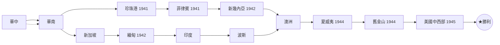
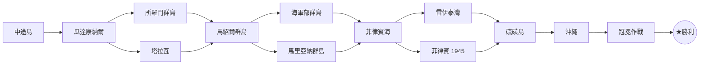

# 太平洋元帥 Pacific General（SSI 1997） — 戰役分支路線（大勝 / 小勝 / 落敗 → 下一戰場 + 聲望）

PacGen 用的是**二進位** `CAMPAIGN.BIN`（與 PG / AG 的純文字 `SCENARIO.TDB` 不同引擎世代）。本文把該檔的分支圖、聲望、以及**節點編號 → 劇本名**對照**完整解碼**出來。分支拓撲、聲望數值、名稱對照皆為**檔案抽出（高信心）**，並經實機 `DEBUG.TXT` 玩局紀錄與兩條戰役起點敘事三重交叉驗證（見下）。

## 資料來源與 provenance

三份彼此獨立的檔案交叉鎖定，缺一不可：

1. **`data/CAMPAIGN.BIN`（2900 bytes，1997-08-26）** — 分支拓撲與聲望：10 個 65B 戰役槽 + 50 個 45B 分支節點，每節點 3×13B link（落敗 / 小勝 / 大勝）。全部數值由此檔逆向抽出。
2. **`PACGEN.EXE`（原版，976896 bytes）內的劇本檔名陣列** — 節點編號 → 劇本名：檔案位移 `0xD54E1`（十進位 873697）起，一段 **54-byte 定長記錄陣列**，每筆前段是劇本 `.SCN` 基底檔名（小寫），共 32 筆（index 0–31）。**`CAMPAIGN.BIN` 的節點編號 = 此陣列的 index**（node[i] 播放 `names[i].scn`，link 目標值也是同一 index 空間）。
   - 註：13KB 的 `BJensen_PacGen_NoCD.exe` 只是 NoCD 載入器（無字串）；劇本檔名陣列在**真正的** `PACGEN.EXE` 引擎執行檔內，前一輪 grep 落空是因誤查了 NoCD 載入器與大寫拼法（陣列內為小寫）。
3. **`DEBUG.TXT`（實機玩局紀錄）** — 驗證：一段真實推進紀錄印出「載入的 `.scn` 檔名」＋「`Current scenario: NN`」，NN 即節點編號。四個錨點與上述陣列完全吻合。

### 節點編號 → 劇本名 對照表（PACGEN.EXE 劇本檔名陣列，index 0–31）

| # | .SCN 基底名 | 劇本（中/英） | # | .SCN 基底名 | 劇本（中/英） |
|---:|---|---|---:|---|---|
| 0 | frisco | 舊金山 1944 (San Francisco 1944) | 16 | okinawa | 沖繩 (Okinawa) |
| 1 | india | 印度 (India) | 17 | iwojima | 硫磺島 (Iwo Jima) |
| 2 | guadcnl | 瓜達康納爾 (Guadalcanal) | 18 | malay | 新加坡 (Singapore) |
| 3 | midway | 中途島 (Midway) | 19 | slmnisl | 所羅門群島 (Solomon Islands) |
| 4 | tarawa | 塔拉瓦 (Tarawa) | 20 | Burma42 | 緬甸 1942 (Burma 1942) |
| 5 | phill44 | 菲律賓 1945 (Philippines 1945) | 21 | persia | 波斯 (Persia) |
| 6 | lyteglf | 雷伊泰灣 (Leyte Gulf) | 22 | guinea | 新幾內亞 1942 (New Guinea 1942) |
| 7 | hawai44 | 夏威夷 1944 (Hawaii 1944) | 23 | henfild | 亨德森機場 (Henderson Field)〔僅 .MAP，無 .SCN〕 |
| 8 | pearl41 | 珍珠港 1941 (Pearl Harbor 1941) | 24 | coronet | 冠冕作戰 (Coronet) |
| 9 | mrnaisl | 馬里亞納群島 (Mariana Islands) | 25 | midinva | 中途島登陸 (Midway Invasion) |
| 10 | cchina | 華中 (Central China) | 26 | halha | 哈拉哈河 (Halha River) |
| 11 | philsea | 菲律賓海 (Philippine Sea) | 27 | sechina | 華南 (Southeast China) |
| 12 | phill41 | 菲律賓 1941 (Philippines 1941) | 28 | chunkng | 重慶 (Chungking) |
| 13 | mrslisl | 馬紹爾群島 (Marshall Islands) | 29 | olympic | 奧林匹克作戰 (Olympic) |
| 14 | admrisl | 海軍部群島 (Admiralty Islands) | 30 | midwest | 美國中西部 1945 (Midwest America 1945) |
| 15 | austral | 澳洲 (Australia) | 31 | dutch | 荷屬東印度 (Dutch East Indies) |

（教學關 `landtut` / `navtut` 為 EXE 內另段硬編碼字串，不進此陣列、不在戰役分支內。中文譯名取自本 repo `scenario_titles.tsv`。）

### 三重驗證（為何確信 node index = 劇本 index）

- **`DEBUG.TXT` 玩局四錨點**：`midway.scn`＝`Current scenario: 03`、`guadcnl.scn`＝02、`slmnisl.scn`＝19、`mrslisl.scn`＝13 — 全部命中陣列 index。且該紀錄的推進序 `midway→(大勝)→guadcnl→(大勝)→slmnisl→(大勝)→mrslisl` 與 `CAMPAIGN.BIN` 節點 3→2→19→13 的大勝 link 完全一致。
- **戰役起點敘事**：戰役槽尾值＝起始節點編號。日方槽 = 節點 **10（cchina 華中）**，正是開場簡報 `brf`「首要任務是奪取華中」；盟方槽 = 節點 **3（midway 中途島）**。
- **地理連貫性**：由起點沿大勝 link 一路展開，兩條鏈都與史實太平洋戰場先後完全吻合（見下二表與 mermaid）。舊版「字母序」假設因地理不連貫被排除，本解不再依賴任何排序假設，而是直接讀 EXE 檔名陣列。

## 檔案格式解碼（第一性，從 CAMPAIGN.BIN 抽）

| 區段 | 位移 | 內容 |
|---|---|---|
| 戰役定義槽 ×10 | `0x000`–`0x289`(650B) | 每槽 65 bytes。僅 2 槽有名稱：`Japanese Campaign`(槽0)、`Allied Campaign`(槽1)；槽 2–9 空。槽尾 5 bytes = `ff ff [campaign_id] [start_node] 00`；日方 `..00 0a 00`(起始節點=10)、盟方 `..01 03 00`(起始節點=3)；空槽 start=`ff`。 |
| 分支節點陣列 ×50 | `0x28a`–`0xb54`(2250B) | 每節點 45 bytes（2250=50×45）。節點 0–42 有資料，43–49 空。 |

**每個 45-byte 節點** = `ff ff`(2) + `03 00 00 00`(4，link 數=3) + **三個 13-byte link**（39）：

```
link = ff ff | type(1) | idxA(2 LE) | idxB(2 LE) | ff ff ff ff(4) | prestige(2 LE)
```

三個 link 順序 = **落敗 / 小勝 / 大勝**（L0 / L1 / L2）。

- `type=01`：單一目標 `idxA`（`idxB`=`ffff` 未用）。
- `type=00`：**兩個目標** `idxA` + `idxB` = 遊戲中的**玩家二選一分支**。
- 特殊負值：`ffff`=空 / 未用、`fffe`(-2)=大勝結局、`fffd`(-3)=小勝結局、`fffc`(-4)=戰敗結局。
- 聲望為該結果基礎獎勵，實戰另受聲望盤(-2…+2)與傷亡增減。

**落敗一律 → 戰敗（DEFEAT）**：PacGen 輸掉任一關即戰役結束（與 PG/AG 常有「敗方支線」不同）。

---

## 日方戰役（Japanese Campaign）

起始：**華中 Central China（節點 10）**。史觀：日本「南進成功」的架空延伸 —— 先平定中國，經東南亞、澳洲，跨太平洋以夏威夷為跳板，最終把戰火帶到美國本土（舊金山、中西部）。與手冊敘事「切斷太平洋、以夏威夷為跳板、把戰火帶到美國本土」吻合。

劇本按戰役推進序（非檔內順序）。「→」右側為該結果進入的下一戰場，`+N` 為聲望。

| 劇本（中/英） | 大勝 MAJOR → 下一戰場 | 小勝 MINOR → 下一戰場 | 落敗 LOSS |
|---|---|---|---|
| 華中（Central China） | 華南(Southeast China) `+750` | 華南(Southeast China) `+600` | ✖戰敗 `+0` |
| 華南（Southeast China） | 新加坡(Singapore) 或 珍珠港 1941(Pearl Harbor 1941) `+750` | 新加坡(Singapore) 或 珍珠港 1941(Pearl Harbor 1941) `+600` | ✖戰敗 `+0` |
| 珍珠港 1941（Pearl Harbor 1941） | 菲律賓 1941(Philippines 1941) `+750` | 菲律賓 1941(Philippines 1941) `+600` | ✖戰敗 `+0` |
| 菲律賓 1941（Philippines 1941） | 新幾內亞 1942(New Guinea 1942) `+850` | 新幾內亞 1942(New Guinea 1942) `+750` | ✖戰敗 `+0` |
| 新幾內亞 1942（New Guinea 1942） | 澳洲(Australia) `+850` | 澳洲(Australia) `+750` | ✖戰敗 `+0` |
| 新加坡（Singapore） | 緬甸 1942(Burma 1942) `+750` | 緬甸 1942(Burma 1942) `+600` | ✖戰敗 `+0` |
| 緬甸 1942（Burma 1942） | 印度(India) `+600` | 印度(India) `+750` | ✖戰敗 `+0` |
| 印度（India） | 波斯(Persia) `+850` | 波斯(Persia) `+750` | ✖戰敗 `+0` |
| 波斯（Persia） | 澳洲(Australia) `+850` | 澳洲(Australia) `+750` | ✖戰敗 `+0` |
| 澳洲（Australia） | 夏威夷 1944(Hawaii 1944) `+1000` | 夏威夷 1944(Hawaii 1944) `+850` | ✖戰敗 `+0` |
| 夏威夷 1944（Hawaii 1944） | 舊金山 1944(San Francisco 1944) `+1000` | 舊金山 1944(San Francisco 1944) `+850` | ✖戰敗 `+0` |
| 舊金山 1944（San Francisco 1944） | 美國中西部 1945(Midwest America 1945) `+1000` | 美國中西部 1945(Midwest America 1945) `+850` | ✖戰敗 `+0` |
| 美國中西部 1945（Midwest America 1945） | ★大勝結局 `+0` | ☆小勝結局 `+0` | ✖戰敗 `+0` |

> 註 1：**華南**是**玩家二選一**節點（`type=00`）—— 打完可選「留在亞洲大陸打新加坡」或「東進偷襲珍珠港」，正對應手冊描述的抉擇。兩條支線最終在**澳洲**匯流。
> 註 2：**緬甸 1942** 的大勝聲望(`+600`)< 小勝(`+750`)，為原始檔內數值（非解碼錯誤），忠實保留。此即舊版標注的「節點 20 大勝<小勝」異常，現確認該節點 = 緬甸 1942。

## 盟方戰役（Allied Campaign）

起始：**中途島 Midway（節點 3）**。史觀：史實美軍太平洋反攻 —— 中途島轉守為攻，逐島蛙跳（瓜島、所羅門、馬紹爾、馬里亞納），經菲律賓海、雷伊泰、硫磺島、沖繩，終於「冠冕作戰」登陸日本本土。

| 劇本（中/英） | 大勝 MAJOR → 下一戰場 | 小勝 MINOR → 下一戰場 | 落敗 LOSS |
|---|---|---|---|
| 中途島（Midway） | 瓜達康納爾(Guadalcanal) `+750` | 瓜達康納爾(Guadalcanal) `+500` | ✖戰敗 `+0` |
| 瓜達康納爾（Guadalcanal） | 所羅門群島(Solomon Islands) 或 塔拉瓦(Tarawa) `+1000` | 所羅門群島(Solomon Islands) 或 塔拉瓦(Tarawa) `+750` | ✖戰敗 `+0` |
| 塔拉瓦（Tarawa） | 馬紹爾群島(Marshall Islands) `+750` | 馬紹爾群島(Marshall Islands) `+500` | ✖戰敗 `+0` |
| 所羅門群島（Solomon Islands） | 馬紹爾群島(Marshall Islands) `+750` | 馬紹爾群島(Marshall Islands) `+500` | ✖戰敗 `+0` |
| 馬紹爾群島（Marshall Islands） | 海軍部群島(Admiralty Islands) 或 馬里亞納群島(Mariana Islands) `+1000` | 海軍部群島(Admiralty Islands) 或 馬里亞納群島(Mariana Islands) `+750` | ✖戰敗 `+0` |
| 馬里亞納群島（Mariana Islands） | 菲律賓海(Philippine Sea) `+750` | 菲律賓海(Philippine Sea) `+500` | ✖戰敗 `+0` |
| 海軍部群島（Admiralty Islands） | 菲律賓海(Philippine Sea) `+750` | 菲律賓海(Philippine Sea) `+500` | ✖戰敗 `+0` |
| 菲律賓海（Philippine Sea） | 雷伊泰灣(Leyte Gulf) 或 菲律賓 1945(Philippines 1945) `+1250` | 雷伊泰灣(Leyte Gulf) 或 菲律賓 1945(Philippines 1945) `+750` | ✖戰敗 `+0` |
| 菲律賓 1945（Philippines 1945） | 硫磺島(Iwo Jima) `+1000` | 硫磺島(Iwo Jima) `+500` | ✖戰敗 `+0` |
| 雷伊泰灣（Leyte Gulf） | 硫磺島(Iwo Jima) `+1000` | 硫磺島(Iwo Jima) `+500` | ✖戰敗 `+0` |
| 硫磺島（Iwo Jima） | 沖繩(Okinawa) `+1250` | 沖繩(Okinawa) `+1000` | ✖戰敗 `+0` |
| 沖繩（Okinawa） | 冠冕作戰(Coronet) `+2750` | 冠冕作戰(Coronet) `+1750` | ✖戰敗 `+0` |
| 冠冕作戰（Coronet） | ★大勝結局 `+0` | ☆小勝結局 `+0` | ✖戰敗 `+0` |

> **玩家二選一**節點（`type=00`）：瓜達康納爾（所羅門｜塔拉瓦）、馬紹爾（海軍部｜馬里亞納）、菲律賓海（雷伊泰｜菲律賓 1945）。兩支各自匯流回主線。

## 勝利前進路線 mermaid

實線 = 大勝、虛線 = 小勝（多數兩者同一目標）；玩家二選一節點分兩箭頭；落敗一律戰敗結局，略。

### 日方戰役



### 盟方戰役



## 未使用 / 孤立節點（不在任一戰役路線內）

`CAMPAIGN.BIN` 有 50 個節點槽，但兩條戰役只用到 26 個（日方 13 + 盟方 13，兩者無交集）。其餘為空槽或**任一戰役起點都到不了的孤立節點**，忠實記錄如下（不臆造其戰役歸屬）：

- **孤立單節點（劇本名已知）**：節點 23=亨德森機場→波斯、25=中途島登陸→新加坡、26=哈拉哈河→印度、29=奧林匹克作戰→緬甸 1942、31=荷屬東印度→波斯。這些劇本各有 `.SCN`（亨德森機場除外，僅 .MAP），但無任何節點指向它們，未編入兩條主線 —— 疑為開發期備用 / 已裁切的入口。
- **孤立叢集（節點 33–42）**：彼此引用（33→35、34→36、36→35/37、41→34、42→35），並通往沖繩(16)/冠冕(24)/雷伊泰(6)，節點 40 為 ★/☆ 結局。此叢集**節點位置 > 31，超出 32 筆劇本檔名陣列**，故其「本身播哪個劇本」無靜態對照可查；且**任一戰役起點都到不了**。研判為**已裁切 / 未啟用的盟方戰役終盤變體**（其終盤同樣收束於沖繩→冠冕，但走向獨立的 40 號結局節點，與正式盟方線的 coronet(24)→結局不同）。因不可玩、且無對應劇本名，不併入上二表。
- 空節點：28、32、43–49。

> 若要進一步確認 33–42 叢集的真實身分，唯一途徑是動態 RE（wine 跑 PacGen，用存檔編輯強制跳到這些節點看載入哪個 `.scn`）。因其不在正常戰役流程內，本文標為「未使用」而不臆測。
