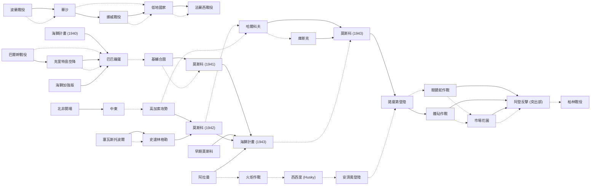

# 裝甲元帥 Panzer General（SSI 1994） — 戰役分支路線（大勝 / 小勝 / 落敗 → 下一戰場 + 聲望）

德軍視角、1939–1946 歐洲戰場的分支戰役。本作 SCENARIO.TDB 共 **38 個 campaign 劇本**（見 `SCENSTAT.BIN` 的劇本順序表，起於 POLAND、終於 SEALION PLUS）。

## 資料來源與 provenance

- **分支與聲望全部抽自遊戲檔** `DATA/SCENARIO.TDB`（SSI 5D 引擎的純文字資料庫，`.` 分隔欄位、CRLF 分隔記錄；本 repo 三個 PG/AG 安裝的此檔 md5 一致）。
- 該檔**最後一列是自我說明的 legend 列**，直接定義各欄語意，因此欄位對應無須臆測：
  ```
  Scenario Name | painting | decisive Scenario Name | marginal Scenario Name | loss Scenario Name | wcnt | timo | dvps | mvps | lspr
  ```
  | 檔內欄位 | 語意 | 對應本文 |
  |---|---|---|
  | `decisive Scenario Name` | 大勝（決定性勝利）後進入的劇本 | 大勝 MAJOR → 下一戰場 |
  | `marginal Scenario Name` | 小勝（邊際勝利）後進入的劇本 | 小勝 MINOR → 下一戰場 |
  | `loss Scenario Name` | 落敗後進入的劇本 | 落敗 LOSS → 下一戰場 |
  | `dvps` / `mvps` / `lspr` | 大勝 / 小勝 / 落敗的聲望獎勵 | 各欄括號內 `+N` |
- 聲望（prestige）為該結果的**基礎獎勵值**；實戰另受難度盤（-2…+2，50%…200%）與戰場表現增減，此處為檔內基準值。
- 中文劇本名取自本 repo 既有 `pg-scenarios.tsv`（台灣軍事史學界慣用譯名）。
- 結局 / 特殊代碼：`DWIN`=大勝結局、`MWIN`=小勝結局、`DRAW`=平手、`LOSS`=戰敗結局、`????`=該欄未存後續劇本名。

> **戰役起點**：歷史線由「波蘭戰役（Poland）1939-09」開始。

## 分支總表

劇本按戰場 / 年代排序（非檔內字母序）。「→」右側為該結果進入的下一戰場，括號 `+N` 為獲得聲望。

| # | 劇本（中 / 英） | 年代 | 大勝 MAJOR → 下一戰場 | 小勝 MINOR → 下一戰場 | 落敗 LOSS → 下一戰場 |
|---:|---|---|---|---|---|
| 1 | 波蘭戰役（Poland） | 1939-09 | 華沙（Warsaw） `+600` | 華沙（Warsaw） `+500` | 戰敗結局（`LOSS`） `+0` |
| 2 | 華沙（Warsaw） | 1939-09 | 挪威戰役（Norway） `+0` | 低地國家（Low Countries） `+0` | 戰敗結局（`LOSS`） `+300` |
| 3 | 挪威戰役（Norway） | 1940-04 | 低地國家（Low Countries） `+1500` | 低地國家（Low Countries） `+750` | 低地國家（Low Countries） `+250` |
| 4 | 低地國家（Low Countries） | 1940-05 | 法蘭西戰役（France） `+600` | 法蘭西戰役（France） `+500` | 法蘭西戰役（France） `+0` |
| 5 | 法蘭西戰役（France） | 1940-05 | `????`（未定義） `+2000` | `????`（未定義） `+1250` | 戰敗結局（`LOSS`） `+1000` |
| 6 | 海獅計畫 (1940)（Sealion (40)） | 1940-08 | 巴巴羅薩（Barbarossa） `+600` | `????`（未定義） `+500` | 戰敗結局（`LOSS`） `+400` |
| 7 | 巴爾幹戰役（Balkans） | 1941-04 | 克里特島空降（Crete） `+800` | 巴巴羅薩（Barbarossa） `+600` | 巴巴羅薩（Barbarossa） `+0` |
| 8 | 克里特島空降（Crete） | 1941-05 | 巴巴羅薩（Barbarossa） `+800` | 巴巴羅薩（Barbarossa） `+600` | 巴巴羅薩（Barbarossa） `+400` |
| 9 | 巴巴羅薩（Barbarossa） | 1941-06 | `????`（未定義） `+700` | 基輔合圍（Kiev） `+400` | `????`（未定義） `+200` |
| 10 | 基輔合圍（Kiev） | 1941-09 | 莫斯科 (1941)（Moscow (41)） `+800` | 莫斯科 (1941)（Moscow (41)） `+500` | 塞瓦斯托波爾（Sevastopol） `+300` |
| 11 | 莫斯科 (1941)（Moscow (41)） | 1941-11 | 海獅計畫 (1943)（Sealion (43)） `+600` | `????`（未定義） `+500` | 塞瓦斯托波爾（Sevastopol） `+0` |
| 12 | 早期莫斯科（Early Moscow） | 1941-10 | 海獅計畫 (1943)（Sealion (43)） `+4000` | `????`（未定義） `+1000` | 塞瓦斯托波爾（Sevastopol） `+500` |
| 13 | 莫斯科 (1942)（Moscow (42)） | 1942-04 | 海獅計畫 (1943)（Sealion (43)） `+800` | 哈爾科夫（Kharkov） `+600` | 哈爾科夫（Kharkov） `+0` |
| 14 | 塞瓦斯托波爾（Sevastopol） | 1942-06 | 史達林格勒（Stalingrad） `+600` | 史達林格勒（Stalingrad） `+500` | `????`（未定義） `+0` |
| 15 | 哈爾科夫（Kharkov） | 1942-05 | 莫斯科 (1943)（Moscow (43)） `+1000` | 庫斯克（Kursk） `+500` | 白俄羅斯（Byelorussia） `+250` |
| 16 | 高加索攻勢（Caucasus） | 1942-07 | 莫斯科 (1942)（Moscow (42)） `+700` | 哈爾科夫（Kharkov） `+400` | 哈爾科夫（Kharkov） `+200` |
| 17 | 史達林格勒（Stalingrad） | 1942-08 | 莫斯科 (1942)（Moscow (42)） `+0` | `????`（未定義） `+0` | 哈爾科夫（Kharkov） `+0` |
| 18 | 庫斯克（Kursk） | 1943-07 | 莫斯科 (1943)（Moscow (43)） `+700` | `????`（未定義） `+300` | 白俄羅斯（Byelorussia） `+200` |
| 19 | 莫斯科 (1943)（Moscow (43)） | 1943-08 | 諾曼第登陸（D-Day） `+1500` | `????`（未定義） `+750` | 白俄羅斯（Byelorussia） `+500` |
| 20 | 海獅計畫 (1943)（Sealion (43)） | 1943-08 | `????`（未定義） `+300` | 莫斯科 (1943)（Moscow (43)） `+200` | 安濟奧登陸（Anzio） `+100` |
| 21 | 海獅加強版（Sealion Plus） | 1943-09 | 巴巴羅薩（Barbarossa） `+1500` | `????`（未定義） `+750` | 戰敗結局（`LOSS`） `+0` |
| 22 | 白俄羅斯（Byelorussia） | 1944-06 | `????`（未定義） `+750` | `????`（未定義） `+500` | `????`（未定義） `+250` |
| 23 | 布達佩斯圍城（Budapest） | 1944-12 | `????`（未定義） `+0` | `????`（未定義） `+0` | `????`（未定義） `+0` |
| 24 | 北非開場（North Africa） | 1940-09 | 中東（Middle East） `+1500` | `????`（未定義） `+750` | 火炬作戰（Torch） `+500` |
| 25 | 阿拉曼（El Alamein） | 1942-10 | 海獅計畫 (1943)（Sealion (43)） `+1500` | 火炬作戰（Torch） `+1000` | 火炬作戰（Torch） `+750` |
| 26 | 中東（Middle East） | 1942-08 | `????`（未定義） `+1000` | 高加索攻勢（Caucasus） `+500` | 阿拉曼（El Alamein） `+0` |
| 27 | 火炬作戰（Torch） | 1942-11 | `????`（未定義） `+800` | 西西里 (Husky)（Husky） `+600` | 西西里 (Husky)（Husky） `+500` |
| 28 | 西西里 (Husky)（Husky） | 1943-07 | `????`（未定義） `+1500` | 安濟奧登陸（Anzio） `+750` | 安濟奧登陸（Anzio） `+500` |
| 29 | 安濟奧登陸（Anzio） | 1944-01 | `????`（未定義） `+0` | 諾曼第登陸（D-Day） `+0` | `????`（未定義） `+0` |
| 30 | 諾曼第登陸（D-Day） | 1944-06 | 鐵砧作戰（Anvil） `+700` | 眼鏡蛇作戰（Cobra） `+500` | 眼鏡蛇作戰（Cobra） `+400` |
| 31 | 眼鏡蛇作戰（Cobra） | 1944-07 | 阿登反擊 (突出部)（Ardennes） `+0` | 市場花園（Market-Garden） `+0` | 市場花園（Market-Garden） `+0` |
| 32 | 鐵砧作戰（Anvil） | 1944-08 | 阿登反擊 (突出部)（Ardennes） `+600` | 市場花園（Market-Garden） `+500` | 市場花園（Market-Garden） `+0` |
| 33 | 市場花園（Market-Garden） | 1944-09 | 阿登反擊 (突出部)（Ardennes） `+2000` | 阿登反擊 (突出部)（Ardennes） `+1250` | `????`（未定義） `+500` |
| 34 | 阿登反擊 (突出部)（Ardennes） | 1944-12 | `????`（未定義） `+600` | 柏林戰役（Berlin） `+0` | 柏林戰役（Berlin） `+0` |
| 35 | 柏林戰役（Berlin） | 1945-04 | 平手結局（`DRAW`） `+2000` | 戰敗結局（`LOSS`） `+1250` | 戰敗結局（`LOSS`） `+500` |
| 36 | 柏林 (東方)（Berlin (East)） | 1945-04 | ☆小勝結局（`MWIN`） `+2500` | 平手結局（`DRAW`） `+1500` | 戰敗結局（`LOSS`） `+500` |
| 37 | 柏林 (西方)（Berlin (West)） | 1945-04 | ☆小勝結局（`MWIN`） `+500` | 平手結局（`DRAW`） `+300` | 戰敗結局（`LOSS`） `+100` |
| 38 | 華盛頓（Washington） | 1946-01 | ★大勝結局（`DWIN`） `+600` | ☆小勝結局（`MWIN`） `+500` | 戰敗結局（`LOSS`） `+0` |

> 註：`Tobruk` 出現在歷史簡介 tsv，但 **SCENARIO.TDB 無對應分支記錄**（不在本作 38 個 campaign 劇本內），故未列入。

## `????` 分支說明（重要）

- `????` 是檔內字面存的 4 個問號（非解碼失敗），代表 **SCENARIO.TDB 在該結果欄未存明確後續劇本名**。
- 本作 27 處 `????` **多數落在「大勝」欄**。與社群資料（Wikipedia、Guru FAQ）交叉比對後研判：這些大勝分支對應**引擎特殊處理 / 需花聲望解鎖的隱藏劇本**，未以劇本名存於此欄。已知兩例（**參考推定，非檔內抽出**）：
  - 大勝**巴巴羅薩**後可花聲望「不繞基輔、直取莫斯科」→ 早期莫斯科（Early Moscow）。檔內此欄為 `????`。
  - 決定性勝利才開放的**海獅計畫（Sealion）**系列；一般勝利不會進入。
- 其餘 `????`（尤其落敗欄）多為「該結果下戰役結束 / 無後續」。**未列於表的數字一律不臆造**；上表只呈現檔內實存值。

## 勝利前進路線 mermaid

只畫「大勝 / 小勝」通往**實際劇本**的連線（實線=大勝、虛線=小勝）；`????`、落敗與結局分支見上表。


