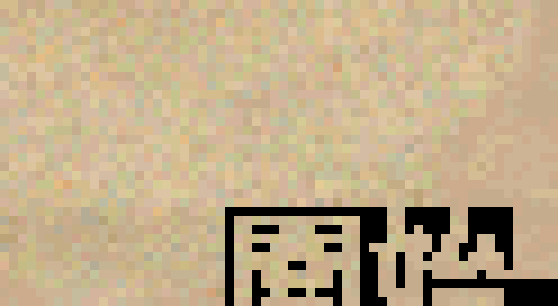

# 10 Plan B:single-byte 造字 + font 加高 — 中文顯示成功 ✅

*不用拉畫布、不用 patch 繪字管線,只改 font 檔 + 字串,讓遊戲顯示清晰中文。已實機驗證。*

## 成功證據



主選單右下角原本的版本號 "v1.1",改成造字碼後顯示「**開始**」兩個清晰中文字(見 `planb-cjk-SUCCESS-full.png` / `-zoom.png`)。**這是遊戲畫面第一次顯示可讀中文**,不是亂碼。

## 為什麼 Plan B 比 Plan A(拉畫布)好

| | A1 拉畫布 | **B single-byte 造字**(採用) |
|---|---|---|
| 動 DirectDraw 畫布 | 要(多 session RE + patch) | **不用** |
| patch 繪字管線 | 可能要 | **不用** |
| Big5 2-byte lookup | 要 | **不用**(single-byte 造字碼) |
| 前提 | — | 選單 23 字 / 全 UI 150 字 < font slot 數 |

## 三個關鍵發現(實機驗證)

### 1. 繪字管線讀 font header 的 height(offset 0x08)

改 `TFONT1.DAT` header `0x08: 08 → 10`(16),遊戲的字**變高了**(v1.1 位置下移 + 下半讀到隔壁 glyph 出現雜條)。對照原版(header=8)乾淨,確認**繪字管線用 header height,不是硬編、不是 per-glyph 算**。

→ 意義:**改 header + 重烤 glyph 就能改字高,完全不碰 EXE 繪字管線**。

### 2. glyph 補到 16 高後 ASCII 正常顯示

`tools/font_rebuild.py` 把所有 glyph 從 8 高補到 16 高(原 pixel 在上、下補空白)+ header=16。實測 "Play Scenario" 等 ASCII 按鈕文字**正常、可讀、不 crash、無破壞**。

### 3. 中文 glyph 塞進未用 byte slot → single-byte 造字

`tools/poc_cjk.py`:PIL + Noto Sans CJK 渲染中文 16×16 點陣,塞進 font 未用 byte slot(POC 用 0x80/0x81 = 開/始)。字串把英文改成對應造字碼(single byte),繪字管線就畫出中文。

→ **中文不走 Big5,走遊戲 font 的 byte code**。150 個 UI 中文字 < 可用 slot 數,塞得下。

## Plan B 完整方法(pipeline)

```
1. font_rebuild.py: 所有 glyph 補到目標高(16) + header height=16
2. poc_cjk.py 擴充: 150 個 UI 中文字 → 16×16 glyph → 塞進未用 byte slot
3. 字串重映射: TXT.PFP + EXE 的中文字串,從 Big5/英文改成 single-byte 造字碼
4. 繪字管線 (不改) 用 header height 自動 blit → 中文顯示
```

## 完整落地待做(v0.8)

1. **byte slot 分配表**:150 個 UI 中文字 → byte code
   - 可用 slot:0x01-0x1F(控制碼,避開 0x00 null/0x09 tab/0x0A/0x0D CRLF)+ 0x7F-0xFF(high byte)≈ 155 slot,夠 150 字
   - 建 `中文 ↔ byte code` 對照表
2. **font atlas**:150 中文 glyph 16×16 烤進 font 未用 slot(擴充 `poc_cjk.py`)
3. **字串重映射工具**:把 v0.5/v0.6 已做的 Big5 CHT(TXT.PFP 119 條 + PACEQUIP + 劇本)改成造字碼版本
   - 原本 Big5 每字 2 byte → 造字碼每字 1 byte,字串會變短,byte-length preserving 更寬鬆
4. **ASCII 補高的黑條**:v1.1 位置下方有黑條(狀態列特殊背景 + 補高空白)。多數文字(Play Scenario)無此問題,但需檢查每個顯示區。可調 `font_rebuild.py` 的 vpos(top/center/bottom)或該區背景
5. **UI 排版**:16 高中文比 8 高英文佔空間,選單按鈕/對話框寬度需檢查溢出(640×480 一行 40 個 16px 中文)

## 工具

- `tools/font_rebuild.py` — glyph 補高 + header height(已驗證)
- `tools/poc_cjk.py` — 中文 glyph 渲染 + 塞 font slot(POC,待擴充成 150 字)

## 里程碑意義

先前所有 Big5 CHT(v0.3-v0.6:119 UI + 33 劇本 + 裝備名)在畫面上是**亂碼**(8×8 font 硬牆)。Plan B 打通了「讓中文真的顯示」的路,且比拉畫布(A1)小得多。**v0.8 把 150 字 atlas + 字串重映射做完,遊戲選單就會是可讀中文。**

原版 EXE / 遊戲檔全程未動(實驗在 `~/` fresh hardlink dir + Xvfb 隔離 display)。
