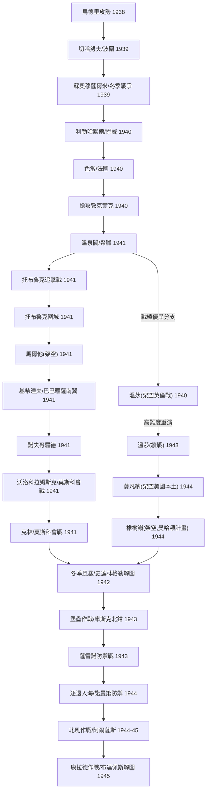

# 《裝甲元帥2》戰役百科

本篇整理《裝甲元帥2》(Panzer General II,SSI,1997)遊戲內出現的**戰役結構**與**劇本歷史背景**。內容原則與譯名慣例見上層 [README.md](README.md)。

## 一、戰役結構總覽

PG2 是全新 Visual C++/DirectDraw 引擎(詳見 [`../中文化規劃.md`](../中文化規劃.md)),戰役機制與 PG1/AG 的 Borland Pascal「5D」引擎**不同源**,不能直接套用舊作的 `SCENARIO.TDB` 分支邏輯。本輪改為直接解析 `SCENARIO/*.CAM`(戰役定義)與 53 個 `*.SCN`(劇本)檔案的字串索引與其配套 `.TXT` 簡報檔,重建出戰役樹狀結構。方法對應 rulebook 62(靜態反追溯源)。

PG2 內建 **5 個戰役檔**(`CAMP1.CAM`~`CAMP5.CAM`),對應 4 個國家陣營、5 條戰役線:

| 戰役檔 | 陣營 | 官方標題 | 起訖年代 | 劇本數 |
|---|---|---|---|---|
| CAMP1 | 德國 | **BLITZKRIEG**(閃擊戰) | 1938–???? | 24(含分支重複節點) |
| CAMP2 | 德國 | **DEFENDING THE REICH**(保衛第三帝國) | 1942–???? | 6(CAMP1 後段的獨立短版入口) |
| CAMP3 | 美國 | **CRUSADE IN THE WEST**(西線聖戰) | 1943–1945 | 6 |
| CAMP4 | 英國 | **CRUSADE IN THE WEST**(西線聖戰) | 1943–1945 | 6 |
| CAMP5 | 蘇聯 | **ONWARD TO BERLIN**(挺進柏林) | 1942–1945 | 6 |

**結構重點**:
- **德國戰役是全案主軸,規模遠大於其他三線**,從 1938 年西班牙內戰一路可打到虛構的「反攻英倫、進犯美國本土」分支,是 PG2 系列最著名的特色(見下方「架空分支」一節)。CAMP2「保衛第三帝國」不是獨立劇情,而是 CAMP1 後半段(冬季風暴以後)的**捷徑入口**——提供不想從西班牙內戰打起的玩家,直接從 1942 年底史達林格勒解圍戰開始的短版德國戰役。
- **美、英兩條戰役線劇本一一對應**(薩雷諾、聖洛、卡昂、阿拉庫爾、梅斯、德紹),同一場史實戰役分別提供美軍與大英國協視角的版本,兵力與部分文字略有差異,但史實背景相同。
- **蘇聯戰役獨立成線**,從史達林格勒解圍戰的蘇軍視角(契爾河畔的土星作戰)開打,終於柏林戰役澤洛高地。
- 除 5 條戰役外,另有 **11 個獨立劇本**(單場對戰 / 教學 / 多人),不掛在任何戰役樹下,列於本文末「獨立劇本」一節。

### 德國戰役分支示意(CAMP1)

德國戰役採樹狀分支:多數節點只有單一後續劇本,但少數節點依戰績(大勝 / 勝利 / 戰術勝利 / 落敗)分流到不同劇本,其中最著名的是打贏法國戰役「色當」後的高難度延伸線——若玩家戰績夠好,戰役會一路帶向**架空的英倫登陸戰與美國本土入侵**,而非在歷史真實的範圍內收尾:

> CAMP2「保衛第三帝國」= 上圖 R→S→T→U→V→W 這一小段的獨立短版入口,供不想從頭打起的玩家使用。

---

## 二、重點劇本歷史考證

以下依年代 / 戰場分節,涵蓋 PG2 主要史實戰役。凡遊戲設定為**架空(what-if)**的劇本另闢一節說明,不與真實戰史混淆。

### 西班牙內戰(1938)

**馬德里攻勢(Madrid Offensive,1938 年 12 月 23 日,劇本 `MADRID.SCN`)**

西班牙內戰(1936–1939)是德、蘇、義三國在正式開戰前測試新式武器與戰術的場地。德國派遣「兀鷹軍團」(Legion Condor)支援佛朗哥的國民軍,提供轟炸機、戰鬥機與少量裝甲部隊;蘇聯則援助共和政府。瓜達拉哈拉(Guadalajara)位於馬德里西北,是內戰期間多次爭奪的要地——1937 年義大利遠征軍曾在此遭共和軍重創,是法西斯陣營在西班牙內戰中少見的挫敗。PG2 以馬德里攻勢作為德國戰役的開場,呼應這段「戰間期實戰演習」的歷史定位:玩家在此關磨練的裝甲戰術與諸兵種協同概念,正是德軍日後閃擊戰的雛形。

### 入侵波蘭(1939)

**切哈努夫(Ciechanow,1939 年 9 月 5 日,劇本 `CIECHAN.SCN`)**

1939 年 9 月 1 日德軍分四路入侵波蘭,切哈努夫與姆瓦瓦(Mlawa)一帶屬北翼第 3 軍團當面戰線。波蘭在此構築了防禦工事(姆瓦瓦防線),一度遲滯德軍裝甲部隊推進,但波蘭陸軍缺乏縱深防禦所需的機動力與空優掩護,防線在數日內被迂迴突破。劇本設定德軍已預先掃蕩波蘭空軍(呼應史實中德國空軍開戰首日即重創波蘭空軍地面設施),要求玩家部隊在蘇聯依《德蘇互不侵犯條約》秘密議定書由東線出兵、瓜分波蘭之前,搶先包圍波軍並推進至布列斯特-立陶夫斯克(Brest-Litovsk)一線。

### 冬季戰爭(1939–1940)

**蘇奧穆薩爾米(Suomussalmi,1939 年 12 月 24 日,劇本 `SUOMUSS.SCN`)**

1939 年 11 月蘇聯入侵芬蘭,爆發「冬季戰爭」。蘇軍第 9 軍團(轄第 44、54、163 等師)企圖沿蘇奧穆薩爾米方向西進切斷芬蘭南北交通、直取波的尼亞灣港口奧盧(Oulu)。芬蘭第 9 師(指揮官希拉斯武奧上校,Hjalmar Siilasvuo)以熟悉地形、擅長滑雪機動的優勢,先擊潰蘇軍第 163 師,再於援軍第 44 師沿拉特路(Raate Road)馳援途中將其分割包圍殲滅,俘獲大量裝備。此役是冬季戰爭中芬蘭最經典的勝仗,總司令曼納海姆元帥(見「將領」篇)判斷蘇奧穆薩爾米若失守,芬蘭將被攔腰切斷,因而傾力死守。

**〔劇本設定提醒〕**:PG2 讓玩家操作「德軍志願部隊」參與此役——這是遊戲的虛構安排。史實上納粹德國在冬季戰爭期間嚴守與蘇聯的互不侵犯條約,並未出兵援芬(德軍援芬部隊是 1941 年「持續戰爭」之後的事)。劇本簡報文字也自行點出這層尷尬:「德蘇互不侵犯條約在,所以你和你的部隊將被視為志願軍;若戰敗,參謀總部將否認一切」,可視為 SSI 對這段史實落差的自覺處理,而非誤植。

### 挪威與法國戰役(1940)

**利勒哈默爾(Lillehammer,1940 年 4 月 20 日,劇本 `LILLEHAM.SCN`)**

德軍於 1940 年 4 月 9 日發動威瑟演習作戰入侵丹麥、挪威,迅速占領奧斯陸。挪威政府拒降並在英國遠征軍支援下沿古德布蘭斯河谷(Gudbrandsdalen)節節抵抗,利勒哈默爾是這條谷地的交通樞紐。德軍山地部隊與傘兵在挪威崎嶇地形中推進速度不如西線,但最終仍在 6 月上旬迫使挪威投降。

**色當(Sedan,1940 年 5 月 13 日,劇本 `SEDAN.SCN`)**

1940 年法國戰役的關鍵一擊。曼施坦因(時任 A 集團軍參謀長)提出「鐮割計畫」(Sichelschnitt),主張裝甲主力避開比利時方向的聯軍主力,改由阿登森林——當時被視為戰車難以通行、因而防禦薄弱——突襲色當,再向英吉利海峽方向直插,切斷北翼聯軍退路。實際執行阿登穿越與色當渡河的是古德里安的第 19 裝甲軍(轄第 1、2、10 裝甲師與精銳「大德意志」步兵團)。5 月 13 日德軍在色當強渡默茲河,法軍第 9 軍團防線幾乎在數小時內崩潰,此役也被視為「閃擊戰」戰術首次獲得決定性戰略成果的範例。劇本簡報刻意提及「1870 年色當之役讓德國躋身列強」(普法戰爭色當會戰,拿破崙三世於此役被俘),點出兩次色當之役在德國軍事史敘事中的呼應。

**搶攻敦克爾克(Race To Dunkirk,1940 年 5 月 21 日,劇本 `RTD.SCN`)**

色當突破後,德軍裝甲兵團向英吉利海峽方向急進,企圖搶占敦克爾克港,將被包圍在法國北部與比利時的英法聯軍主力堵死在陸地上。史實上希特勒於 5 月 24 日下達了著名的「停止前進令」,讓裝甲部隊暫緩攻勢,使英軍得以在其後的「發電機行動」中,從敦克爾克海灘撤出逾 33 萬名官兵——這個決策至今仍是二戰史學界爭論的焦點之一(裝甲部隊耗損需要整補、戈林主張空軍可獨力解決、地形不利裝甲作戰等說法並存)。

### 巴爾幹與北非(1941–1942)

**溫泉關(Thermopylae,1941 年 4 月 17 日,劇本 `THERMOPY.SCN`)**

1941 年 4 月德軍發動巴爾幹戰役,南下入侵希臘。英國派遣的紐澳軍團(ANZAC,含澳洲、紐西蘭部隊)在向雅典撤退途中,於古典時代溫泉關(西元前 480 年斯巴達三百壯士殉國之地)一帶且戰且走,試圖遲滯德軍推進以掩護撤退。此役地形崎嶇、易守難攻,但兵力懸殊下英軍終究無法久守,最終大部分兵力撤往克里特島(隨後又爆發克里特島空降作戰)。

**托布魯克追擊戰與圍城戰(Pursuit to Tobruk / Tobruk,1941 年 4 月,劇本 `PTT.SCN` / `TOBRUK.SCN`)**

1941 年 2 月隆美爾率德國非洲軍抵達利比亞後迅速轉守為攻,將先前擊敗義軍的英軍一路逐回埃及邊境,僅托布魯克港因守軍(以澳軍第 9 師為主力)堅守而未能攻克。托布魯克其後被圍困長達 241 天,直到 1941 年 11 月「十字軍作戰」解圍為止,是北非戰場拉鋸的重要象徵。

**大鍋(Cauldron,1942 年 6 月 5 日,劇本 `CAULDRON.SCN`,獨立劇本)**

1942 年 5–6 月加查拉戰役(Battle of Gazala)中,隆美爾裝甲部隊一度陷入英軍雷區防線後方、補給困難的險境,這塊被己方戲稱為「大鍋」(The Cauldron)的口袋地帶險象環生。6 月初英軍第 8 軍團試圖合圍殲滅這股德軍卻功虧一簣,隆美爾隨後反守為攻,不僅穩住陣腳更趁勢再度掌握戰場主動,加查拉戰役最終以英軍潰敗、托布魯克在 6 月底陷落告終。

### 東線:巴巴羅薩至莫斯科會戰(1941)

**基希涅夫(Kishinev,1941 年 7 月 9 日,劇本 `KISHINEV.SCN`)**

1941 年 6 月 22 日德國發動巴巴羅薩作戰入侵蘇聯,南翼由羅馬尼亞(安東尼斯庫元帥政權,軸心國夥伴)出兵配合德軍,目標是收復 1940 年被蘇聯強占的比薩拉比亞(今摩爾多瓦一帶)。基希涅夫(今摩爾多瓦首都基希讷乌)是該地區最重要的城市,劇本反映的正是德羅聯軍協同收復失土的政治與軍事意義。

**諾夫哥羅德(Novgorod,1941 年 8 月 15 日,劇本 `NOVGOROD.SCN`)**與**沃洛科拉姆斯克(Volokolamsk,1941 年 10 月 25 日,劇本 `VOLOKOL.SCN`)**、**克林(Klin,1941 年 11 月 15 日,劇本 `KLIN.SCN`)**

三役皆屬 1941 年下半年德軍中央 / 北方集團軍向莫斯科、列寧格勒推進的攻勢節點:諾夫哥羅德以南的斯塔拉亞魯薩扼守列寧格勒與莫斯科間的交通線;沃洛科拉姆斯克公路是德軍逼近莫斯科西北郊的主要通道之一;克林則已進入莫斯科會戰最後階段的合圍嘗試。德軍雖持續推進,但戰線拉長、後勤困難疊加提前到來的嚴冬,攻勢終在莫斯科城郊力竭,蘇軍隨即於 12 月發動反攻。

### 史達林格勒與庫斯克(1942–1943)

**冬季風暴作戰(Winter Storm,1942 年 12 月 12 日,劇本 `WINTER.SCN`)與契爾河畔的土星作戰(Saturn on the Chir,1942 年 11 月 18 日,劇本 `SATURN.SCN`)**

這兩個劇本分別是德、蘇雙方對同一段史實(史達林格勒解圍戰)的視角版本。1942 年 11 月蘇軍發動天王星作戰,合圍德國第 6 軍團於史達林格勒;12 月曼施坦因指揮新編頓河集團軍發動「冬季風暴作戰」試圖解圍,霍特(Hoth)第 4 裝甲軍團主攻,巴爾克(Balck)第 11 裝甲師負責掩護側翼的契爾河防線(詳見「將領」篇巴爾克條目)。蘇軍隨後又發動「小土星作戰」猛攻軸心國軍後方補給線,迫使德軍解圍嘗試在距被圍第 6 軍團僅約 48 公里處被迫放棄。第 6 軍團最終於 1943 年 2 月 2 日投降,是德軍在東線的第一次重大戰略性慘敗。

**堡壘作戰(Zitadelle,1943 年 7 月 5 日,劇本 `PROK1.SCN`)與普羅霍羅夫卡(Prokhorovka,1943 年 7 月 12 日,劇本 `PROK2.SCN`)**

庫斯克會戰是德軍在東線發動的最後一次大型戰略攻勢,計畫代號「堡壘作戰」(Zitadelle),意圖以北、南兩鉗合圍庫斯克突出部內的蘇軍。德軍因等待新型虎式、豹式戰車到位一再延後開戰日期,蘇軍則利用這段時間構築了縱深逾百公里的多層防禦陣地與雷區。北鉗(第 9 軍團)進攻普羅霍羅夫卡方向受阻,南鉗雖有進展但仍未能達成合圍。7 月 12 日蘇軍在普羅霍羅夫卡投入近衛第 5 戰車軍團展開反擊,傳統上被稱為「史上最大戰車會戰」。

**〔史學考證提醒〕**:冷戰後解密檔案顯示,普羅霍羅夫卡當日參戰戰車數量遠低於戰後蘇聯方面(戰場指揮官羅特米斯特羅夫回憶錄)宣稱的雙方各 700–800 輛;較嚴謹的統計約為德軍 294 輛、蘇軍 616 輛(納入鄰近部隊則各約 429 與 870 輛)。「史上最大戰車會戰」之說近年也受到部分史學家(如 David Glantz)質疑,認為 1941 年布羅德會戰投入戰車規模可能更大。普羅霍羅夫卡的歷史地位更多在於它是蘇軍成功遏止德軍最後一次東線戰略攻勢的象徵性節點,而非單純的數字之最。

### 義大利與諾曼第(1943–1944)

**雪崩作戰(Avalanche,1943 年 8 月 9 日,劇本 `SAL3.SCN`,獨立劇本)與薩雷諾-重返歐陸(1943 年 9 月 27 日,劇本 `SALERNO1/2.SCN`)**

1943 年 9 月盟軍在義大利薩雷諾灣搶灘登陸(代號「雪崩作戰」),企圖建立進軍義大利本土的第一個灘頭。德軍第 10 軍團一度將灘頭壓縮到岌岌可危的地步,盟軍靠密集海軍艦砲支援才穩住陣腳。灘頭鞏固後盟軍隨即向那不勒斯方向推進,PG2 分別以美、英視角提供了這段攻勢的劇本。

**聖洛與卡昂(St. Lo / Caen,1944 年 6–7 月,劇本 `STLO*.SCN` / `CAEN*.SCN`)**

諾曼第登陸後,盟軍在樹籬密布的博卡吉鄉間(bocage)推進艱難。英軍蒙哥馬利在登陸首日即承諾攻下卡昂,但這座諾曼第古城(征服者威廉的故鄉)直到 7 月「查恩伍德作戰」才部分收復,再經 7 月中旬「古德伍德作戰」裝甲攻勢才完全突破卡昂以南陣地。美軍方面則在聖洛一線苦戰月餘,最終於 7 月 25 日發動「眼鏡蛇作戰」實現大突破,開啟法萊斯包圍戰與整個西線盟軍的快速推進。PG2 為此段戰役提供了多達 5 個劇本(聖洛推進戰、聖洛-眼鏡蛇作戰、查恩伍德、古德伍德、逐退入海),是遊戲中劇本密度最高的單一戰場。

**阿拉庫爾(Arracourt,1944 年 9 月 8 日,劇本 `ARRACT.SCN` / `ARRACTUK.SCN`)**

法萊斯包圍戰後德軍在西線全面潰退,巴頓第三軍團企圖以南錫(Nancy)為跳板,向德國本土發動秋季攻勢。德軍緊急拼湊新編第 5 裝甲軍團(曼陶菲爾指揮,轄新式「豹」式戰車編成的第 111、112、113 裝甲旅)在阿拉庫爾一帶發動反擊。這場為期約 11 天的戰車戰,美軍第 4 裝甲師 A 戰鬥群憑藉更佳的情報、戰術運用與地形掌握,以損失約 48 輛戰車的代價擊毀、擊傷德軍約 200 輛戰車與突擊砲(德軍投入約 262 輛),是美軍在西線最成功的裝甲防禦戰之一。

**梅斯(Metz,1944 年 11 月 17 日,劇本 `METZ.SCN` / `METZUK.SCN`)**

梅斯是德國陸軍軍官與士官訓練學校所在地,城區周邊環繞十九世紀末以來構築的多層要塞群。巴頓第三軍團自 9 月起圍攻梅斯,因後勤補給優先讓予諾曼第登陸後北翼的蒙哥馬利部隊(市場花園作戰),攻勢一度受限,直到 11 月中旬才在優勢兵力下攻克——梅斯因而被稱為「自 1870 年以來首座被強攻攻陷的要塞城市」。

### 東線終局(1943–1945)

**卡涅夫(Kanev,1943 年 9 月 23 日,劇本 `KANEV.SCN`)**

庫斯克會戰後蘇軍轉入戰略反攻,沿第聶伯河一線強渡追擊西撤德軍,卡涅夫是這波渡河作戰的節點之一,蘇軍空降部隊亦投入協同作戰。第聶伯河一線的爭奪最終導致 1944 年初科爾松-契爾卡瑟一帶德軍遭合圍的重大損失。

**列寧格勒解圍(1944 年 1 月 14 日,劇本 `LENIN.SCN`)**

德軍自 1941 年 9 月起圍困列寧格勒近 900 天,城內居民在饑荒與砲擊中承受慘重傷亡(估計逾百萬平民死亡)。1944 年 1 月蘇軍列寧格勒方面軍與沃爾霍夫方面軍發動攻勢,徹底解除圍城,是蘇聯衛國戰爭敘事中份量極重的一役。

**維堡(Viipuri,1944 年 6 月 15 日,劇本 `VIIPURI.SCN`)**

1944 年夏季蘇軍發動維堡-彼得羅扎沃茨克攻勢,兵鋒直指芬蘭第二大城維堡(芬蘭語 Viipuri,今屬俄羅斯 Vyborg)。芬蘭雖頑強抵抗並一度穩住新防線,但在蘇軍持續壓力與德國盟友自身戰局惡化的雙重壓力下,同年 9 月與蘇聯簽署停戰協定退出戰爭。

**北風作戰(Nordwind,1944 年 12 月 30 日,劇本 `NORDWIND.SCN`)**

突出部之役(阿登戰役)進入尾聲之際,德軍在阿爾薩斯地區發動代號「北風作戰」的輔助攻勢,企圖利用美軍主力北調應付阿登戰事的空檔,奪回史特拉斯堡一帶。此役是德軍在西線發動的最後一次戰略性攻勢。

**康拉德作戰(Operation Konrad,1945 年 1 月 14 日,劇本 `KONRAD.SCN`)**

1944 年 12 月蘇軍合圍布達佩斯,城內德匈守軍陷入絕境。黨衛軍第 4 裝甲軍先後三度(康拉德一、二、三號作戰)嘗試解圍,其中康拉德三號一度突破蘇軍防線推進至距布達佩斯僅約 25 公里處,但終究未能突破蘇軍第 4 近衛軍團的攔截。布達佩斯守軍於 1945 年 2 月突圍失敗後投降,匈牙利也是德國在歐陸最後一個放棄的盟友。

**澤洛高地(Seelow Heights,1945 年 4 月 14 日,劇本 `SEELOW.SCN`)**

柏林戰役開幕戰。澤洛高地是柏林以東最後一道具防禦價值的天然地形,朱可夫第 1 白俄羅斯方面軍在此投入近百萬兵力強攻,三天激戰付出慘重代價才突破防線。與此同時科涅夫第 1 烏克蘭方面軍從南翼快速突進,史達林刻意讓兩位元帥互別苗頭競速攻入柏林市區,是東線戰爭尾聲極具戲劇性的一段指揮部政治(詳見「將領」篇)。

**德紹(Dessau,1945 年 4 月 11 日,劇本 `DESSAU.SCN` / `DESSAUUK.SCN`)**

戰爭尾聲,美軍第 3 裝甲師搶在蘇軍之前奪取德紹一處實驗機場,以防止德國噴射機、火箭等新式武器技術落入蘇聯之手——呼應戰後美蘇兩強競相搜捕德國尖端軍事科研成果與科學家(如「迴紋針行動」)的歷史背景。

---

## 三、架空(what-if)分支——PG2 的特色設計

PG2 德國戰役最為人津津樂道之處,是若玩家戰績持續優異,劇情會脫離史實走向,進入一條**假設性的「軸心國獲勝」延伸戰線**。這些劇本的簡報文字本身就明白標註「假設」(Assuming...)、「架空」(Hypothetical)字樣,SSI 自己也未將其包裝為史實,本篇比照原則不將其當作真實歷史敘述。

- **溫莎(Windsor,1940 年 9 月 / 1943 年 4 月,兩個劇本)**——設定為德軍已成功搶灘英國本土(史實中「海獅作戰」因缺乏制空 / 制海權從未真正發動),向溫莎推進以切斷倫敦與內陸的聯繫,逼迫倫敦投降。
- **馬爾他(Malta,1941 年 5 月)**——對應史實中確實存在但從未執行的「大力神作戰」(Operation Hercules)德義聯合空降奪島計畫;劇本簡報明白註記「軸心國從未真正具備發動此役的條件」。
- **薩凡納 / 橡樹嶺(Savannah / Oak Ridge,1944 年)**——戰線最誇張的延伸:德軍(在遊戲設定中)成功登陸美國東岸,先奪佐治亞州薩凡納港,再深入田納西州橡樹嶺——現實中橡樹嶺正是曼哈頓計畫鈾濃縮設施所在地。劇本簡報直接點名「美國人正在建造一種威力驚人的爆炸性武器」,是遊戲對真實原子彈研發計畫的架空影射,結局依戰績決定玩家是否搶在原子彈成軍前摧毀設施。
- **直布羅陀或死(Gibraltar or Bust,1940 年 9 月,獨立劇本)**——對應史實中希特勒與佛朗哥會談後,西班牙以種種理由拒絕讓軸心軍假道進攻英國控制的直布羅陀要塞(這場會談史稱「上鏈的鐘」〔the watch that would not run〕,是二戰外交史上著名的失敗會晤)。劇本假設西班牙在英國支持下正面迎戰軸心國進犯。
- **芬蘭完蛋?/ 芬蘭假期(Finnish Finished? / Finnish Vacation,1945 年)**——延續設定下,芬蘭在德國協助下試圖奪回一年前(1944 年停戰條款)割讓給蘇聯的土地;史實上芬蘭在 1944 年 9 月停戰後已退出戰爭並轉向對德作戰(拉普蘭戰爭),此劇本純屬架空。
- **赤潮湧現(Red Tide Rising,1945 年 6 月,兩個劇本)**——大戰結束後盟蘇互不信任升高為直接軍事衝突,蘇軍在德紹近郊攻擊美英部隊。這類「二戰結束後盟蘇立即開戰」的假設,是冷戰初期兵棋愛好者間常見的推演題材(現實中類似構想的英國「不可思議行動」〔Operation Unthinkable〕確實在 1945 年被邱吉爾下令研究過,但從未付諸執行)。

---

## 四、獨立劇本(不屬任何戰役)

以下劇本可單獨遊玩或供多人對戰,不掛在 5 條戰役樹下。除已於前兩節談過歷史背景者(大鍋、雪崩作戰、聖洛-眼鏡蛇作戰、直布羅陀或死、芬蘭完蛋?、赤潮湧現),其餘性質如下:

| 劇本 | 標題 | 性質 | 說明 |
|---|---|---|---|
| `TUTORIAL.SCN` | 教學關-馬德里攻勢 | 教學 | 新手教學關,沿用馬德里攻勢地圖與部分兵力,4 回合速成 |
| `4PLAYER.SCN` | 四人混戰 | 多人 | 沿用切哈努夫(波蘭)地圖的四人對戰劇本,虛擬時間點(1945-08) |
| `FINF4.SCN` | 芬蘭假期 | 多人 | 「芬蘭完蛋?」的四人對戰版本 |
| `MULTIRED.SCN` | 赤潮湧現(三人版) | 多人 | 「赤潮湧現」的三人對戰版本 |
| `MULTIBEA.SCN` | 困熊記(多人) | 多人 | 柏林近郊澤洛高地地圖的多人對戰劇本 |

---

## 五、資料來源與方法

- **戰役結構**:解析 `SCENARIO/CAMP1.CAM`~`CAMP5.CAM` 的字串索引(`.scn`/`.mus`/`.txt` 檔名序列),還原劇本先後順序與分支點。
- **劇本標題與簡報**:每個 `.SCN` 內部以字串形式引用一個 `.TXT` 檔(如 `MADRID.SCN` → `MO.txt`),此檔第一行即官方劇本標題,其後為日期、簡報段落、玩家數、回合數——此為 SSI 原版英文簡報,本篇**不直譯**,僅作為史實查證與寫作的原始依據,正文為原創中文敘述。另有一組獨立的「將領對話簡報」文字(如 `GE1I.TXT`)用於戰役節點間的劇情過場,同樣僅供考證,不直譯。
- **史實查證**:重大戰役背景另以公開來源(維基百科、War History Network、HistoryNet、The Tank Museum 等)查證日期、部隊番號與有爭議的史學論點(如普羅霍羅夫卡戰車數量),詳見各段落內文標註。
- **架空分支判定**:凡 SSI 原文簡報本身出現 "Assuming"、"Hypothetical" 或明顯違反戰爭實際結果(如美國本土遭入侵)者,判定為架空分支,不與真實戰史並列敘述。

## 待考證 / 待續

- 各劇本詳細勝負條件、地圖規模、對應歷史部隊番號的完整清單——本輪僅涵蓋歷史背景,未逐劇本列出兵棋層面的兵力對照(如需要可另建 `戰役-兵力對照.tsv`)。
- CAMP1 的完整分支機率與勝負門檻(如同 PG1/AG 的 `campaign-routes-*.md`)尚未逐節點解出二進位分支邏輯,本篇僅呈現線性順序與已知的關鍵分支點(色當前的三條入場路徑、溫莎之後的高分支)。
- `PG3DE250.exe`(疑 3D 加速版)是否有額外或不同劇本,尚未比對。
